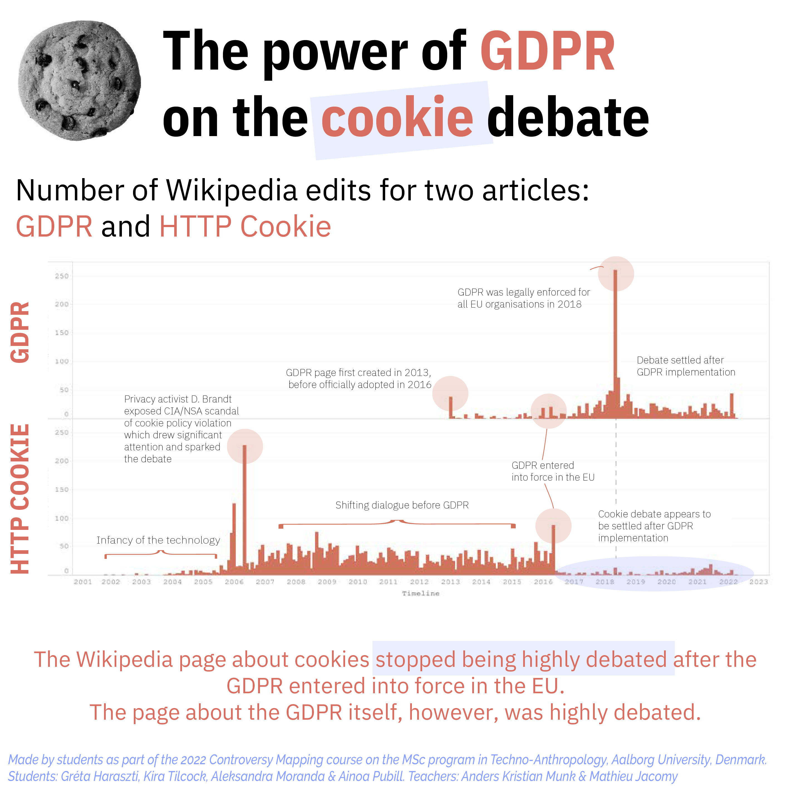
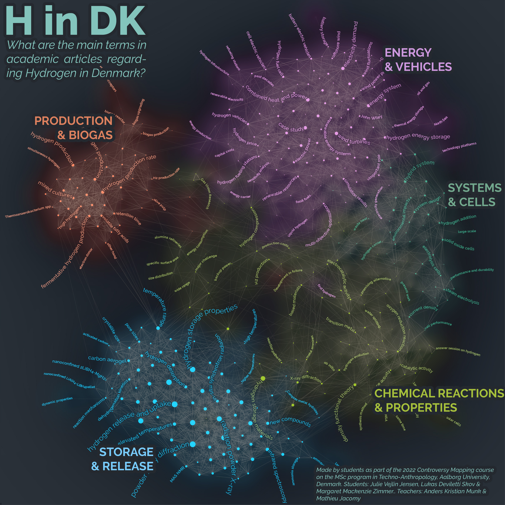
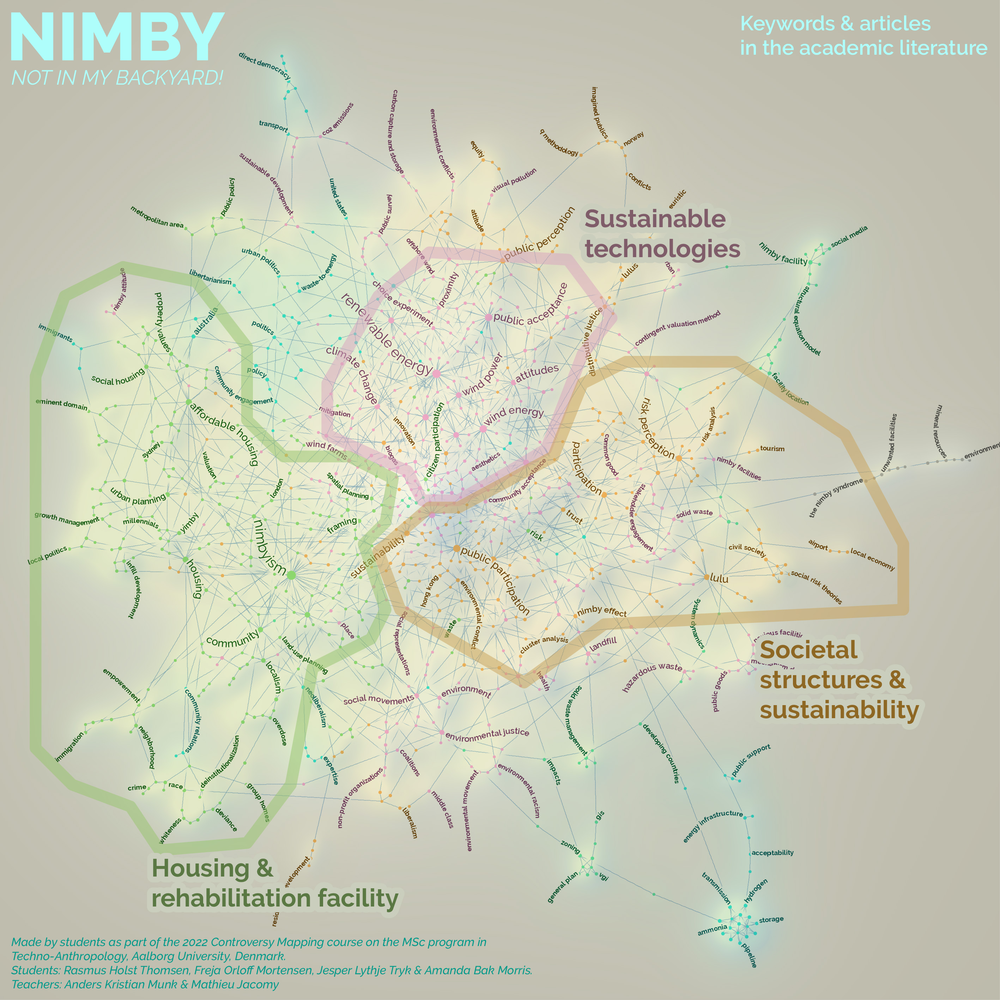
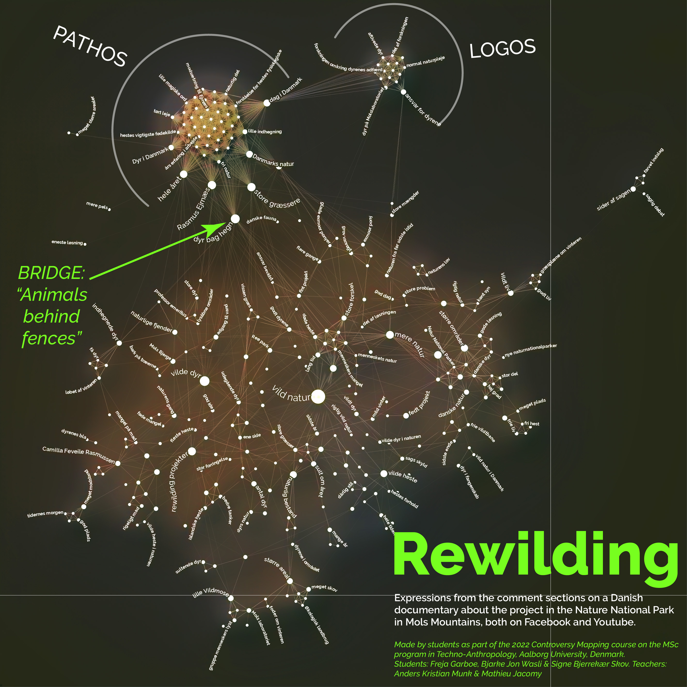
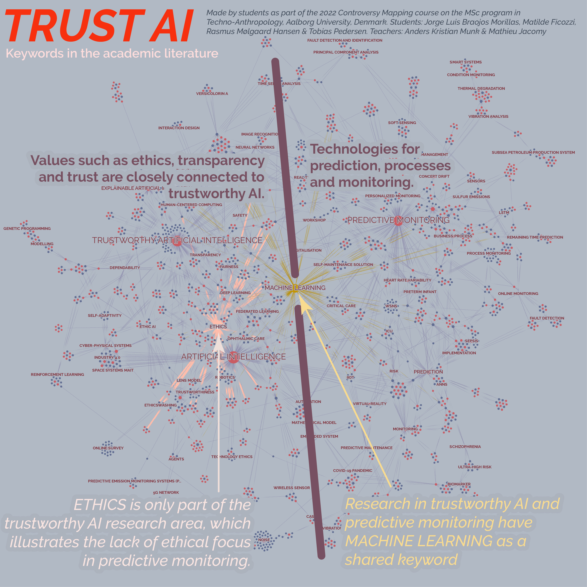

## Short stories for social media (2022)

These mini posters are from the students in 2022, with additional graphical design by us. We published them on social media. Each visualization makes a point. That point and the annotations are entirely from the students' work.

## Reports from the students (2022)

You can find below the reports submitted but the students who have produced the five examples above. Those were satisfying reports you can draw inspiration from.

* [Mapping internet cookies](../assets/gallery-reports/2022/Internet Cookies.pdf)
* [Citizen perspectives on Power-to-X technologies](../assets/gallery-reports/2022/Power to X.pdf)
* [NIMBY: Not in my back yard!](../assets/gallery-reports/2022/Nimby.pdf)
* [I don’t want to see a dead horse when taking a walk!](../assets/gallery-reports/2022/Rewilding.pdf)
* [The need of trust in AI](../assets/gallery-reports/2022/Trust AI.pdf)
