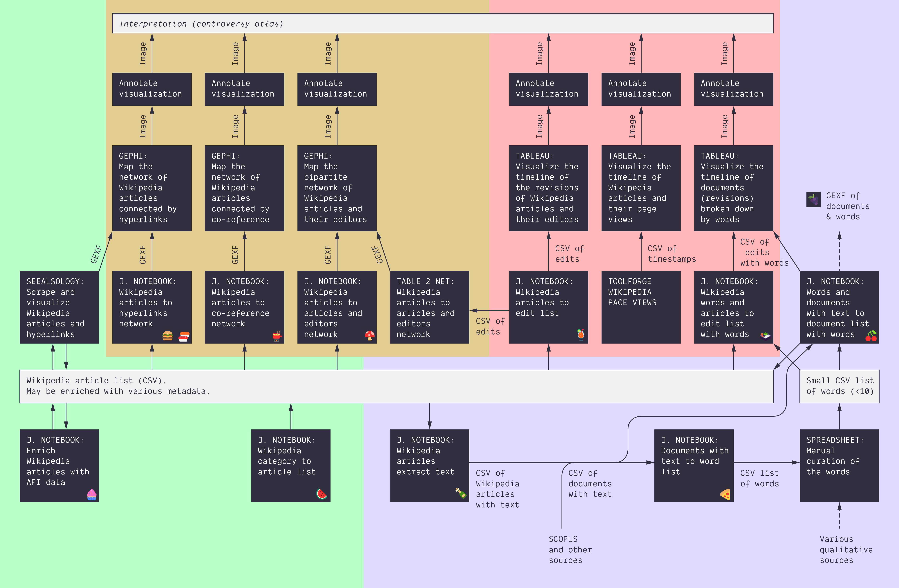

These tutorials include the following notebooks, in order of apparition *(the emoji are just a visual help)*:

* 🍹 [Wikipedia articles to edits list](https://colab.research.google.com/github/jacomyma/mapping-controversies/blob/main/notebooks/Wikipedia_articles_to_edits_list.ipynb) *([GitHub](https://github.com/jacomyma/mapping-controversies/blob/main/notebooks/Wikipedia_articles_to_edits_list.ipynb))*
* 🍉 [Wikipedia category to article list](https://colab.research.google.com/github/jacomyma/mapping-controversies/blob/main/notebooks/Wikipedia_category_to_article_list.ipynb) *([GitHub](https://github.com/jacomyma/mapping-controversies/blob/main/notebooks/Wikipedia_category_to_article_list.ipynb))*
* 🫕 [Wikipedia articles to co-reference network](https://colab.research.google.com/github/jacomyma/mapping-controversies/blob/main/notebooks/Wikipedia_articles_to_co_reference_network.ipynb) *([GitHub](https://github.com/jacomyma/mapping-controversies/blob/main/notebooks/Wikipedia_articles_to_co_reference_network.ipynb))*
* 🍄 [Wikipedia articles to articles and editors network](https://colab.research.google.com/github/jacomyma/mapping-controversies/blob/main/notebooks/Wikipedia_articles_to_articles_and_editors_network.ipynb) *([GitHub](https://github.com/jacomyma/mapping-controversies/blob/main/notebooks/Wikipedia_articles_to_articles_and_editors_network.ipynb))*
* 🍱 [Wikipedia words and articles to edit list with words](https://colab.research.google.com/github/jacomyma/mapping-controversies/blob/main/notebooks/Wikipedia_words_and_articles_to_edit_list_with_words.ipynb) *([GitHub](https://github.com/jacomyma/mapping-controversies/blob/main/notebooks/Wikipedia_words_and_articles_to_edit_list_with_words.ipynb))*
* 🍾 [Wikipedia articles extract text](https://colab.research.google.com/github/jacomyma/mapping-controversies/blob/main/notebooks/Wikipedia_articles_extract_text.ipynb) *([GitHub](https://github.com/jacomyma/mapping-controversies/blob/main/notebooks/Wikipedia_articles_extract_text.ipynb))*
* 🍕 [Documents with text to word list](https://colab.research.google.com/github/jacomyma/mapping-controversies/blob/main/notebooks/Documents_with_text_to_word_list.ipynb) *([GitHub](https://github.com/jacomyma/mapping-controversies/blob/main/notebooks/Documents_with_text_to_word_list.ipynb))*
* 🍒 [Words and documents with text to document list with words](https://colab.research.google.com/github/jacomyma/mapping-controversies/blob/main/notebooks/Words_and_documents_with_text_to_document_list_with_words.ipynb) *([GitHub](https://github.com/jacomyma/mapping-controversies/blob/main/notebooks/Words_and_documents_with_text_to_document_list_with_words.ipynb))*
* 🍇 [Words and documents with text to network](https://colab.research.google.com/github/jacomyma/mapping-controversies/blob/main/notebooks/Words_and_documents_with_text_to_network.ipynb) *([GitHub](https://github.com/jacomyma/mapping-controversies/blob/main/notebooks/Words_and_documents_with_text_to_network.ipynb))*
* 🍔 [Wikipedia articles to hyperlinks network (quick and dirty)](https://colab.research.google.com/github/jacomyma/mapping-controversies/blob/main/notebooks/Wikipedia_articles_to_hyperlinks_network_quick_and_dirty.ipynb) *([GitHub](https://github.com/jacomyma/mapping-controversies/blob/main/notebooks/Wikipedia_articles_to_hyperlinks_network_quick_and_dirty.ipynb))*
* 🍣 [Wikipedia articles to hyperlinks network (slow and clean)](https://colab.research.google.com/github/jacomyma/mapping-controversies/blob/main/notebooks/Wikipedia_articles_to_hyperlinks_network_slow_and_clean.ipynb) *([GitHub](https://github.com/jacomyma/mapping-controversies/blob/main/notebooks/Wikipedia_articles_to_hyperlinks_network_slow_and_clean.ipynb))*
* 🧁 [Enrich Wikipedia articles with API data](https://colab.research.google.com/github/jacomyma/mapping-controversies/blob/main/notebooks/Enrich_Wikipedia_articles_with_API_data.ipynb) *([GitHub](https://github.com/jacomyma/mapping-controversies/blob/main/notebooks/Enrich_Wikipedia_articles_with_API_data.ipynb))*
* 🍪 [Wikipedia article to edit list with full content](https://colab.research.google.com/github/jacomyma/mapping-controversies/blob/main/notebooks/Wikipedia_article_to_edit_list_with_full_content.ipynb) *([GitHub](https://github.com/jacomyma/mapping-controversies/blob/main/notebooks/Wikipedia_article_to_edit_list_with_full_content.ipynb))*

# Overview

These notebooks feed into each other this way:

