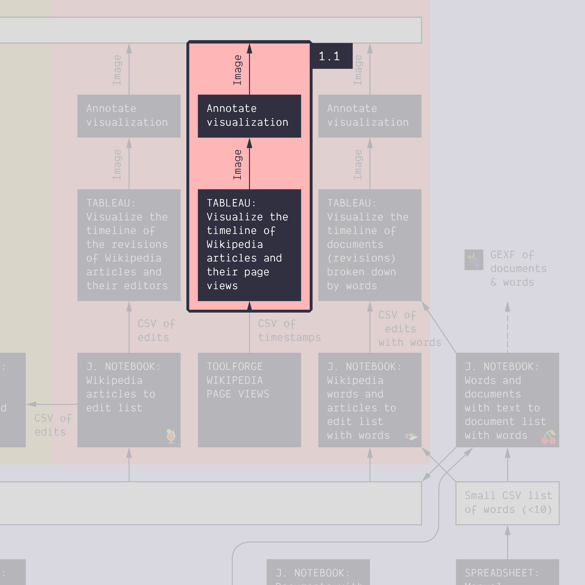

**Duration: 30 min**

[
	
](../assets/images/1-1.jpg)

**Goals**
* Learn how to use Google Spreadsheet to **annotate a visualization**
* Discover **Tableau Software**, a visualization tool
* Make an annotated visualization, and share it

**You need**
* Tableau Desktop installed on your computer
* A Tableau Desktop license
* A Google account to use Google Slides

# Case

In this series of tutorials we will work with the issue of energy conversion. Energy conversion is [the process of changing energy from one form to another](https://en.wikipedia.org/wiki/Energy_transformation). Wind turbines, solar farms, or geothermal power plants are all examples of energy conversion technologies. So are nuclear reactors and combustion engines. In other words, energy conversion technologies are key actors in controversies around climate change, sustainable transitions, and zero carbon futures.


Let us begin by exploring how public interest in two of the more exotic energy conversion technologies that might revolutionize the green transition - namely [space-based solar power](https://en.wikipedia.org/wiki/Space-based_solar_power) and [thorium-based nuclear power](https://en.wikipedia.org/wiki/Thorium-based_nuclear_power) - has changed over time. 

# Data

Download this CSV:

[
	<i class="fas fa-file-csv" style="font-size:5em"></i><br>
	pageviews-20150701-20211231.csv
](../assets/data/1-1/pageviews-20150701-20211231.csv)

It contains the page view data for both articles on Wikipedia in the period from 2015 to 2021.
It comes from [this tool](https://pageviews.toolforge.org/?project=en.wikipedia.org&platform=all-access&agent=user&redirects=0&start=2015-07&end=2021-12&pages=Space-based_solar_power|Thorium-based_nuclear_power) but we will see that later on.

# Load data into Tableau

* Open Tableau Desktop
* Load the file from above. To do that, look into the sidebar, under "To a File" and click on "Text file", then upload the file ```pageviews-20150701-20211231.csv```
* Check that the data are parsed correctly: you should see three columns. If not, you need to [change the settings](https://help.tableau.com/current/pro/desktop/en-gb/examples_text.htm#set-text-file-options).
* Also check that the columns have the right type. The first column should be dates. If it is parsed as something else, for instance text or numbers, then you need to [change its type](https://help.tableau.com/current/pro/desktop/en-us/datafields_typesandroles_datatypes.htm).
* Click on "Sheet 1" in the bottom of the screen, to start creating your first visualization.

# Visualize the data as a simple timeline

Try aggregating the days to show monthly variations. It may look like this:
[
	
](../assets/images/1-1/basic-timeline.jpg)

# Export the visualization as an image

Export the visualization as a static image from the menu:

```
Worksheet > Export > Image...
```

Save as a ```.PNG``` file that we can easily reuse in Google Slides

# Import the image into Google Slides

You can basically open the image in your OS and copy-paste it into a Google Slides, or import it from the menu:
```
Insert > Image > Upload from computer
```

# Annotate the visualization
Some help:
- [November 2015 space-based solar energy spike](https://www.google.dk/search?q=space-based+solar+power&sxsrf=APq-WBt1C_23EirNE2q22dQTZH5B2w8d4g%3A1643919456713&source=lnt&tbs=cdr%3A1%2Ccd_min%3A11%2F1%2F2015%2Ccd_max%3A12%2F1%2F2015&tbm=)
- [June 2019 space-based solar energy spike](https://www.google.dk/search?q=space-based+solar+power&sxsrf=APq-WBtPC_A4zzk0j5HIcTysWs_G8EJdYA%3A1643919521765&source=lnt&tbs=cdr%3A1%2Ccd_min%3A6%2F1%2F2019%2Ccd_max%3A7%2F1%2F2019&tbm=)
- [October 2016 thorium-based nuclear energy spike](https://www.google.dk/search?q=thorium-based+nuclear+power&tbs=cdr%3A1%2Ccd_min%3A10%2F1%2F2016%2Ccd_max%3A11%2F1%2F2016&sxsrf=APq-WBvU6vJzohQ7gS9t83zL48ttc1jvmw%3A1643921238178&ei=Vj_8Yb2tCsvHrgTMra-ABQ&ved=0ahUKEwi9sMLrs-T1AhXLo4sKHczWC1AQ4dUDCA4&uact=5&oq=thorium-based+nuclear+power&gs_lcp=Cgdnd3Mtd2l6EAMyBQgAEIAEMgUIABCABDIECAAQHjIECAAQHjIECAAQHjIECAAQHjIECAAQHjIGCAAQBRAeMgYIABAFEB46BwgjELADECc6CQgAELADEAcQHjoICAAQgAQQsAM6BwgAELADEB46BwgjELACECc6BggAEAcQHjoICAAQBxAFEB5KBAhBGAFKBAhGGABQxQJY0QRg9w5oAXAAeACAAVSIAacBkgEBMpgBAKABAcgBCsABAQ&sclient=gws-wiz)

# Export the slide as an image

You can export a static image from the menu:
```
File > Download > JPEG image
```

# Next tutorial

[<i class="fas fa-forward"></i> 1.2. Visualize a different dataset with Tableau *(15 min)*](../1.2/)

---

### Additional resources

* [An intro to Tableau in 23 minutes](https://www.youtube.com/watch?v=jEgVto5QME8)