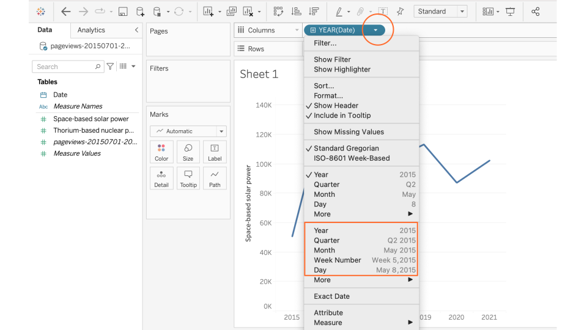
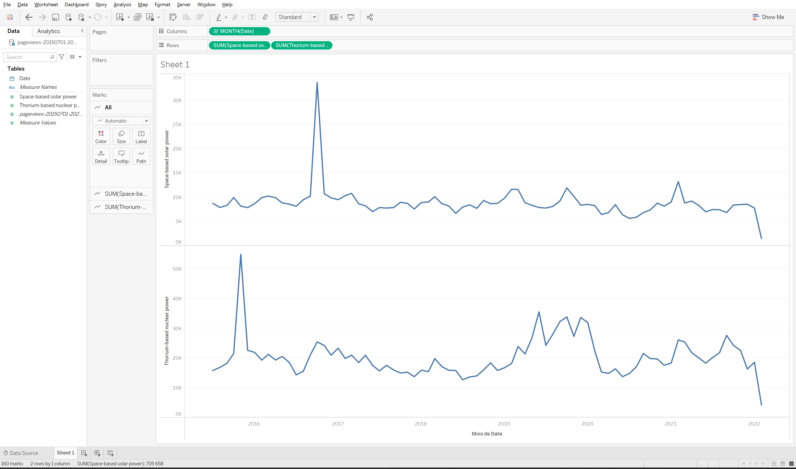

**Duration: 30 min**

[
	
](../assets/images/1-1.jpg)

**Goals**
* Learn how to use Google Slides to **annotate a visualization**
* Discover **Tableau Desktop**, a visualization tool
* Make an annotated visualization, and share it

**You need**
* Tableau Desktop installed on your computer
* A Tableau Desktop license
* A Google account to use Google Slides

# Case

In this series of tutorials we will work with the issue of energy conversion. Energy conversion is [the process of changing energy from one form to another](https://en.wikipedia.org/wiki/Energy_transformation). Wind turbines, solar farms, or geothermal power plants are all examples of energy conversion technologies. So are nuclear reactors and combustion engines. In other words, energy conversion technologies are key actors in controversies around climate change, sustainable transitions, and zero carbon futures.


Let us begin by exploring how public interest in two of the more exotic energy conversion technologies that might revolutionize the green transition - namely [space-based solar power](https://en.wikipedia.org/wiki/Space-based_solar_power) and [thorium-based nuclear power](https://en.wikipedia.org/wiki/Thorium-based_nuclear_power) - has changed over time. 

# Data

Download this CSV:

<center><a href="../assets/data/1-1/pageviews-20150701-20220206.csv">
	<i class="fas fa-file-csv" style="font-size:5em"></i><br>
	pageviews-20150701-20220206.csv
</a><br><br></center>

It contains the page view data for both articles on Wikipedia in the period from 2015 to 2021.
It comes from [this tool](https://pageviews.toolforge.org/?project=en.wikipedia.org&platform=all-access&agent=user&redirects=0&start=2015-07&end=2021-12&pages=Space-based_solar_power|Thorium-based_nuclear_power) but we will see that later on in the tutorial.

# Video tutorial

Note: the file mentioned in this video is the one you just downloaded.



# Load data into Tableau

* Open Tableau Desktop
* Load the CSV file you just downloaded above. To do that, look into the sidebar under "To a File" and click on "Text file", then upload the file ```pageviews-20150701-20220206.csv```
* Check that the data are parsed correctly: you should see three columns. If not, you need to [change the settings](https://help.tableau.com/current/pro/desktop/en-gb/examples_text.htm#set-text-file-options).
* Also check that the columns have the right type. The first column should be dates. If it is parsed as something else, for instance text or numbers, then you need to [change its type](https://help.tableau.com/current/pro/desktop/en-us/datafields_typesandroles_datatypes.htm).

It may look like this (notice that the first column is parsed as dates).

[
	
](../assets/images/1-1/MappingControversies_TutorialScreenshots_TableauParsing.svg)


# Visualize the data as a simple timeline

* Click on the "Sheet 1" tab in the bottom of the screen to start creating your first visualization.
* On the left under "Tables" you will see the data columns you just parsed: "Date", "Thorium-based nuclear power", and "Space-based solar power". You can drag and drop them onto your sheet.
* At the top of the sheet you will see two horizontal fields called "Columns" and "Rows". Dropping your data into each of them will define what should be represented on the horizontal and vertical axis in your visualization. Since we are building a timeline, let us begin by dragging "Date" into the "Columns" field (will represent time on the horizontal axis).
* Drag either Thorium-based nuclear power" or "Space-based solar power" into the "Rows" field. You should now see a timeline. You can also drag both into the "Rows" field to generate two timelimes for comparison.
* Since you have not told Tableau how you want to aggregate the page views - day by day, week by week, quarter by quarter, year by year - it will make an arbitrary choice. Perhaps your first timeline is aggreated in years. You should change this depending on your interest. To do so, click on the dropdown menu for "Date" in the "Columns" field:

[
	
](../assets/images/1-1/MappingControversies_TutorialScreenshots_TableauDateSetting.svg)

* There are multiple settings to choose from. Note that if you want to show the tilmeline week by week or month by month, there are two ways to do it. By default, Tableau will just aggregate all the data for a month or a week, for example for August, without considering for which year. Since we want to show the timeline month by month from 2015 to 2021, we should therefore choose "Month     May, 2015" from the second section of options (highlighted on the screenshot above) rather than just "Month    May". 


The result may look like this:
[
	
](../assets/images/1-1/timeline.png)

# Export the visualization as an image

Export the visualization as a static image from the menu:

```
Worksheet > Export > Image...
```

Save as a ```.PNG``` file that we can easily reuse in Google Slides

# Import the image into Google Slides



You can basically open the image in your OS and copy-paste it into a Google Slides, or import it from the menu:
```
Insert > Image > Upload from computer
```

# Annotate the visualization
The last step is to annotate the timeline. The goal is to help the reader make sense of the spikes in page views by adding small textual explainers. You can [follow this template](https://docs.google.com/presentation/d/1sUoBD0Q0DjBOsV-lgFbvlVQIGF4gYfWbUN88iE-GUTQ/edit?usp=sharing) to see how it can be done in Google Sheets. You can copy the slide show (File > Make a copy > Entire presentation) to edit your own version. 

[
	
](../assets/images/1-1/MappingControversies_AnnotationExamples_PageViews_SpaceBasedSolar.svg)

Annotate the remaining spikes. If you have time, replace the timeline with the page views for Thorium-based nuclear power and annotate that instead. 

Annotation requires some exploration. We could assume that an increase in page views on Wikipedia corresponds to an increase in public interest. If this is the case, then it makes sense to explore what events were in the news around that point in time. In the example above we use a simple Google News search for "Space-based solar power" with a custom time range for [February 2021](https://www.google.dk/search?q=%22space-based+solar+power%22&biw=1418&bih=682&tbs=cdr%3A1%2Ccd_min%3A2%2F1%2F2021%2Ccd_max%3A3%2F1%2F2021&tbm=nws&sxsrf=APq-WBu-F0ZC0BBYcYaD5nGaChCSJ5z7jQ%3A1644350453841&ei=9csCYp30Mo7NrgTai4LQBw&ved=0ahUKEwjdwr_l8vD1AhWOposKHdqFAHoQ4dUDCA0&uact=5&oq=%22space-based+solar+power%22&gs_lcp=Cgxnd3Mtd2l6LW5ld3MQAzIFCAAQgAQyBQgAEIAEMgUIABCABDIFCAAQgAQyBQgAEIAEMgUIABCABDIFCAAQgAQyBQgAEIAEMgUIABCABDIFCAAQgAQ6BAgAEEM6BggAEAcQHlCwA1iWDWCbD2gAcAB4AIABjgKIAbIDkgEFMi4wLjGYAQCgAQHAAQE&sclient=gws-wiz-news), [October 2019](https://www.google.dk/search?q=%22space-based+solar+power%22&biw=1418&bih=682&tbs=cdr%3A1%2Ccd_min%3A10%2F1%2F2019%2Ccd_max%3A11%2F1%2F2019&tbm=nws&sxsrf=APq-WBvcdd_o_zZ9rlBxobFBAX_Y9rXrTg%3A1644348814341&ei=jsUCYtCoFMSSwPAP6c6D8AQ&ved=0ahUKEwjQp9zX7PD1AhVECRAIHWnnAE4Q4dUDCA0&uact=5&oq=%22space-based+solar+power%22&gs_lcp=Cgxnd3Mtd2l6LW5ld3MQAzIFCAAQgAQyBggAEAcQHjIGCAAQBxAeMgYIABAHEB4yBggAEAcQHjIGCAAQBxAeMgYIABAHEB4yBggAEAcQHjIGCAAQBxAeMgYIABAHEB46BAgAEENQ2AVYzxRguBhoAHAAeACAAVKIAeQBkgEBM5gBAKABAcABAQ&sclient=gws-wiz-news), and [February/March 2019](https://www.google.dk/search?q=%22space-based+solar+power%22&biw=1418&bih=682&sxsrf=APq-WBs74uo48B6TBuo7TyaSCQK1NW-AxA%3A1644348845061&source=lnt&tbs=cdr%3A1%2Ccd_min%3A2%2F1%2F2019%2Ccd_max%3A4%2F1%2F2019&tbm=nws) respectively. Try to adjust the time range to capture some of the other spikes and explore the search results to come up with a good annotation.

<div class="notice--warning"><i class="fas fa-exclamation-triangle"></i>&nbsp;<b>CAUTION:</b> For some of the spikes, notably some of the bigger ones in both timelines, no good explanation can be found in the news. We will return to why that is the case at a later stage. For now, leave them unannotated.</div>


# Export the slide as an image

You can export a static image from the menu:
```
File > Download > JPEG image
```

# Documents produced

Keep somewhere, for sharing, the following document:
* The annotated visualization (JPEG or PNG)

# Next tutorial

[<i class="fas fa-forward"></i>&nbsp;1.2. Visualize a different dataset with Tableau *(30 min)*](../1.2/)

---

### Additional resources

* [An intro to Tableau in 23 minutes](https://www.youtube.com/watch?v=jEgVto5QME8)
* An example of [Tableau visualizations annotated in Google Slides](https://docs.google.com/presentation/d/1WFBRnr-USNOybHRmKWfGwpOffqFH8PB_SfzDQuBwKI0/edit?usp=sharing), looking into "OK Boomer" on Twitter, during the DMI Winter School 2022

