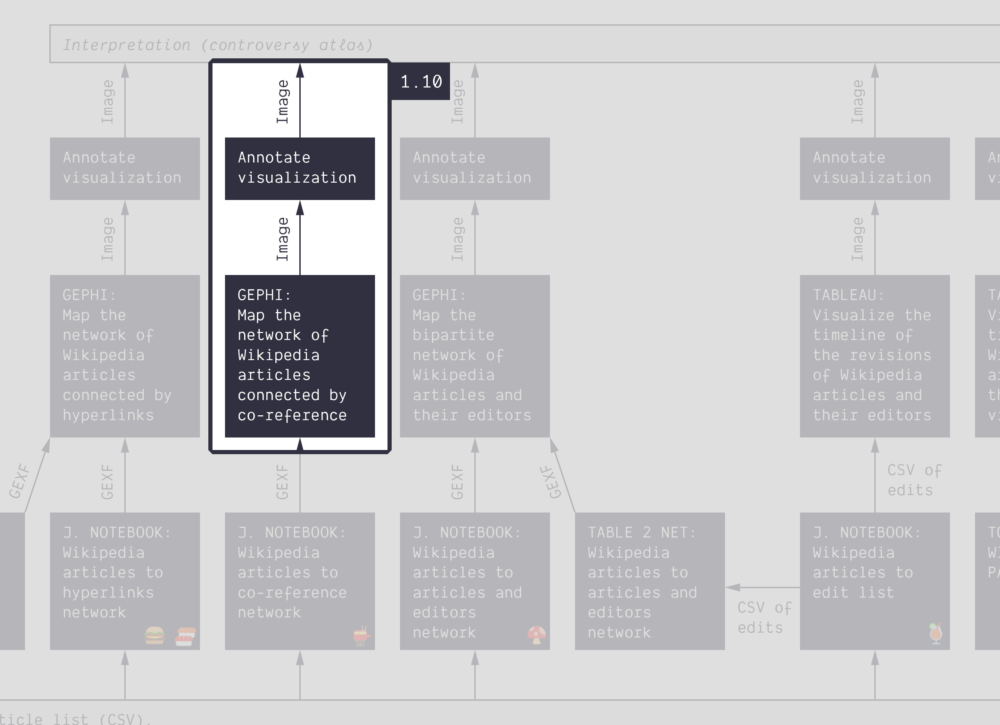
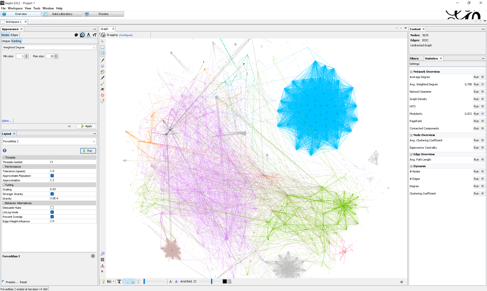

**Duration: 15 min**

[
	
](../assets/images/1-10.jpg)

**Goals**
* Visualize a **weighted** network
* Produce an annotated network map

# Data

Download this GEXF:

<center><a href="../assets/data/1-10/energy-conversion-coreference-network.gexf">
	<i class="fas fa-file" style="font-size:5em"></i><br>
	energy-conversion-coreference-network.gexf
</a><br><br></center>

It is the network of the 3628 articles from the Wikipedia category [energy conversion](https://en.wikipedia.org/wiki/Category:Energy_conversion) (at two levels of subcategories) connected when they have the same external *references* in common. On a Wikipedia page, the references are the footnotes with links to external sources that you find below the text. Two articles with many references in common could be said to be written with support from roughtly the same knowledge base.

This file was harvested using the notebook [🍉&nbsp;Wikipedia category to article list](https://colab.research.google.com/github/jacomyma/mapping-controversies/blob/main/notebooks/Wikipedia_category_to_article_list.ipynb), giving this [<i class="fas fa-file-csv"></i>&nbsp;CSV file](../assets/data/1-10/wikipedia-articles-cat-energy-conversion.csv) containing the articles, that is then fed into the notebook [🫕&nbsp;Wikipedia articles to co-reference network](https://colab.research.google.com/github/jacomyma/mapping-controversies/blob/main/notebooks/Wikipedia_articles_to_co_reference_network.ipynb) that harvest Wikipedia further, and builds the network. We will see that in [tutorial 2.3](../2.3/).

# Visualize the network

Visualize the network. You will notice that edges have a thickness. It corresponds to their *weight*: a score between 0 and 1 (generally) that brings nuance. Intuitively, edges with a higher weight make stronger connections.

The layout algorithm *Force Atlas 2* uses the weights to set the attraction force between the connected nodes. You can adjust the importance of the weight for the algorithm by adjusting the setting ```Edge Weight Influence```:
* At ```0.0``` the edge weights are ignored.
* Between ```0.0``` and ```1.0``` they are taken into account, but attenuated.
* At ```1.0``` the edges pull exactly as much as their weight.
* Above ```1.0```, the edge weights are empasized.

Gephi computes the degree at any time, but you may compute the *weighted degree* from the ```Statistics``` panel (the sum of the weights of connected edges). It is a pretty useful centrality metric in this context. Betweenness centrality also takes weights into account (it is computed along with the ```Network diameter```).

By using modularity clustering for node color and weighted degree for node size, and tuning the layout settings, one can a visualization like this one:

[
	
](../assets/images/1-10/weighted-network.png)


# Make an annotated visualization

Annotate your visualization. You may focus on clusters or nodes, or both. Can you make a data-driven point about the references used in these articles? 

# Documents produced

Keep somewhere, for sharing, the following document:
* The annotated network (JPEG or PNG)

# Next tutorial

You may want to take a short walk at this point. Take a break, then check this:

[<i class="fas fa-forward"></i>&nbsp;1.11. From data to network with Table2Net *(45 min)*](../1.11/)

---

### Relation to course readings

* The principles and concepts of Visual Network Analysis (VNA) are covered in **Chapter 2: What is visual network analysis** in *Jacomy, M. (2021). Situating Visual Network Analysis*
* And in **Chapter 7: Visual network analysis** in *Venturini, T. & Munk, A.K. (2021). Controversy Mapping: A Field Guide*
* The intricacies of Wikipedia and the different ways in which the platform may be reappropriated for controversy analysis are covered in *Weltevrede, E., & Borra, E. (2016).* **Platform affordances and data practices: The value of dispute on Wikipedia**
*Big Data & Society, 3(1).*
* A similar network is described in **Figure 51** of *Venturini, T. & Munk, A.K. (2021). Controversy Mapping: A Field Guide*:

[
	
](https://medihal.archives-ouvertes.fr/hal-03227378/image)
*Network of pages from the “Circumcision” category on Wikipedia connected by the degree to which they reference the same external sources. Pages about male circumcision group on the left (dark gray with white center) while pages about female circumcision (known here as female genital mutilation) group on the right (white with black center)*
