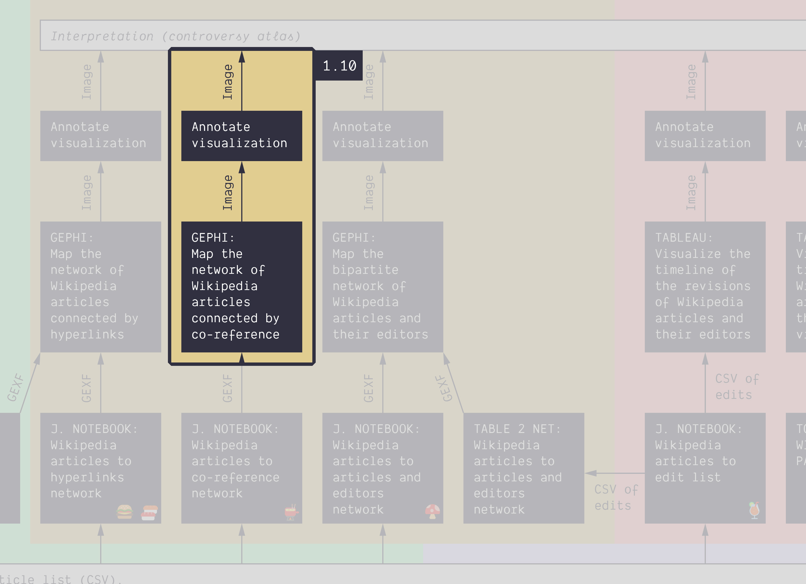

**Duration: 15 min**

**Goals**
* Check what makes a **weighted** network special
* Produce an annotated network map

# Data

Download this GEXF:

<a href="../assets/data/1-9/wikipedia-articles-editors-network.gexf">
	<i class="fas fa-file" style="font-size:5em"></i> 
	wikipedia-articles-editors-network.gexf
</a>  

This file was obtained by extracting the 3629 articles from the Wikipedia category [energy conversion](https://en.wikipedia.org/wiki/Category:Energy_conversion) using the notebook [🍉&nbsp;Wikipedia category to article list](https://colab.research.google.com/github/jacomyma/mapping-controversies/blob/main/notebooks/Wikipedia_category_to_article_list.ipynb). It gives this [<i class="fas fa-file-csv"></i>&nbsp;CSV file](../assets/data/1-10/wikipedia-articles-cat-energy-conversion.csv), that is then fed into
the notebook [🫕&nbsp;Wikipedia articles to co-reference network](https://colab.research.google.com/github/jacomyma/mapping-controversies/blob/main/notebooks/Wikipedia_articles_to_co_reference_network.ipynb).

# Lorem Ipsum

I have not produced this network yet but the category file used to produce the hyperlink equivalent is here: https://drive.google.com/file/d/135CowQ3LB2U-HlaHD0aB4hTh-G5OBJoO/view?usp=sharing

# Next tutorial

You may want to take a short walk at this point. Then check this:

[1.11. From data to network with Table2Net *45 min*](../1.11/)
