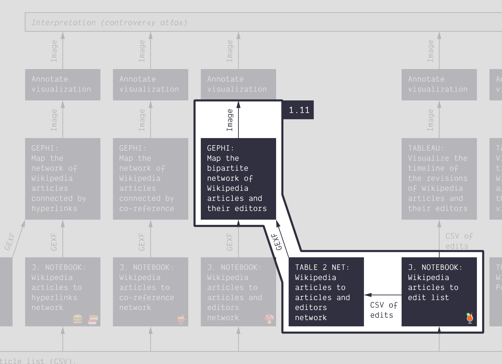
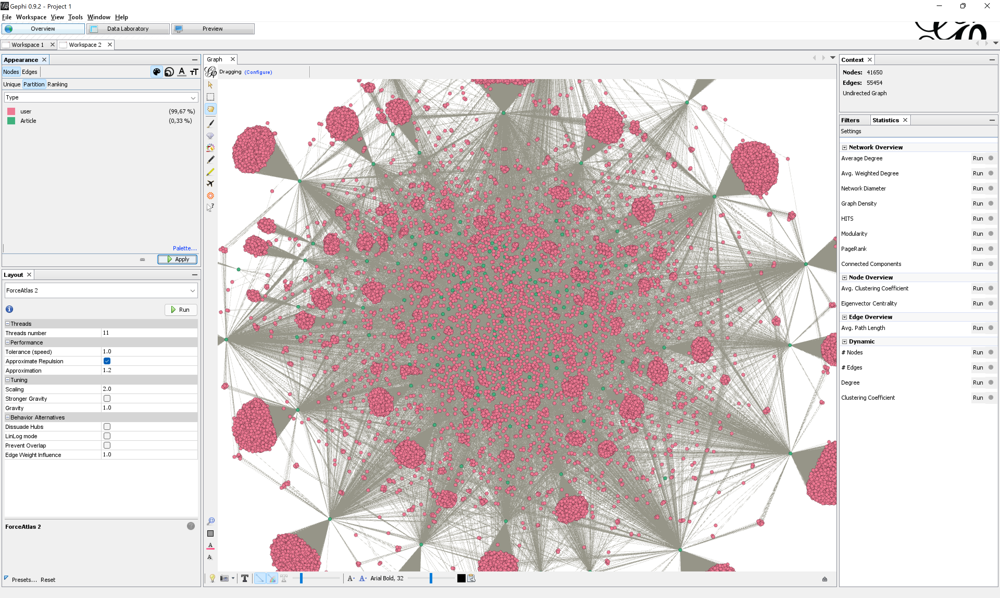

**Duration: 45 min**

[
	
](../assets/images/1-11.jpg)

**Goals**
* Know that you can **extract a network** from a table
* Learn how to use **Table2Net** (online tool)
* Activate your new network visualization skills
* Make an annotated network map

# Data

Download this CSV:

<center><a href="../assets/data/1-11/energy-conversion-category-depth-0.csv">
	<i class="fas fa-file-csv" style="font-size:5em"></i><br>
	energy-conversion-category-depth-0.csv
</a><br><br></center>

It just contains the list of 139 articles in the Wikipedia category [energy conversion](https://en.wikipedia.org/wiki/Category:Energy_conversion) (including subcategories).

# Harvest the list of edits

Harvest the list of edits using the following notebook. The instructions are specified in it. Expect the harvesting to take several minutes (have a tea!).

[🍹&nbsp;Wikipedia articles to edits list](https://colab.research.google.com/github/jacomyma/mapping-controversies/blob/main/notebooks/Wikipedia_articles_to_edits_list.ipynb)

It should provide you with a CSV table of edits, similar to that of tutorials [1.2](../1.2/) and [1.3](../1.3/), but bigger. You could visualize it in Tableau, but we will do something else.

***Note:** you must learn to use the notebooks we provide. But assuming that something went wrong, you can find the file you are supposed to produce [<i class="fas fa-file-csv"></i>&nbsp;here](../assets/data/1-11/wikipedia-edits.csv).*

# Extract a network using Table2Net

[Table2Net](https://medialab.github.io/table2net/) is an online tool to extract a network (GEXF) from a table (CSV). Your goal is to extract a **bipartite network of articles and editors** from the tabular list of revisions you just harvested. Follow the instructions below:

* Open [Table2Net](https://medialab.github.io/table2net/)
* Upload the CSV file
* Type of network: choose ```Bipartite```
* For the first type of nodes, pick the column that represents *articles*: ```page``` (```Article``` would work as well).
* Leave ```One expression per cell``` as it is (the cell content is not a list).
* You do not need attributes for those nodes.
* For the second type of nodes, pick the column that represents *editors*: ```user```. Remark that ```userid``` would also work, but it would be less explicit.
* Leave ```One expression per cell``` as it is (idem).
* You do not need attributes for those nodes either.
* Scroll to the end of the page and click on ```Build the network```.

You will obtain a bipartite network of articles and users. If you are lost, use [<i class="fas fa-file"></i>&nbsp;this network](../assets/data/1-11/article-editor-network.gexf).

[
	
](../assets/images/1-11/network-preview.png)

**NOTE:** We introduce Table2Net because it works on **any CSV**, not just Wikipedia data, contrary to most of our notebooks. If you decide to use **other data sources**, Table2Net might therefore prove very useful to you. Read the documentation included in the tool to understand it better. It allows extracting monopartite (regular) networks as well, for instance *editors connected when they edited the same article* or conversely, *articles connected when they were edited by the same editor*.

# Make an annotated network map

You are now in the same situation as in the [tutorial 1.9](../1.9/), but since the tool used is slightly different, there are minor differences. You might be more comfortable with Gephi now, and do things a bit differently. Do as you wish.

We suggest that you:
* Filter the network, because it is so big, and there are so many "leaves" (nodes that have only one neighbor). The leaves are not super interesting, because they do not connect multiple other nodes. Those leaves are mostly editors who contributed to only one article.
* Use a centrality metric to bring hierarchy to the nodes. Degree? Closeness? Betweenness? Up to you.
* Visualize this centrality as node sizes
* Visualize node types as color

Can you tell a better data-driven story, in your annotations, than in tutorial 1.9? Not that you have to. The important is that you get more efficient and autonomous at this exercise.

# Documents produced

Keep somewhere the following document somewhere for sharing:
* The annotated network (JPEG or PNG)

# Next tutorial

Take a break! Then check this:

[<i class="fas fa-forward"></i>&nbsp;1.12. Activate your knowledge about Gephi *(45 min)*](../1.12/)

---

### Relation to the course readings

* The principles and concepts of Visual Network Analysis (VNA) are covered in **Chapter 2: What is visual network analysis** in *Jacomy, M. (2021). Situating Visual Network Analysis*
* And in **Chapter 7: Visual network analysis** in *Venturini, T. & Munk, A.K. (2021). Controversy Mapping: A Field Guide*
* The intricacies of Wikipedia and the different ways in which the platform may be reappropriated for controversy analysis are covered in *Weltevrede, E., & Borra, E. (2016).* **Platform affordances and data practices: The value of dispute on Wikipedia**
*Big Data & Society, 3(1).*
