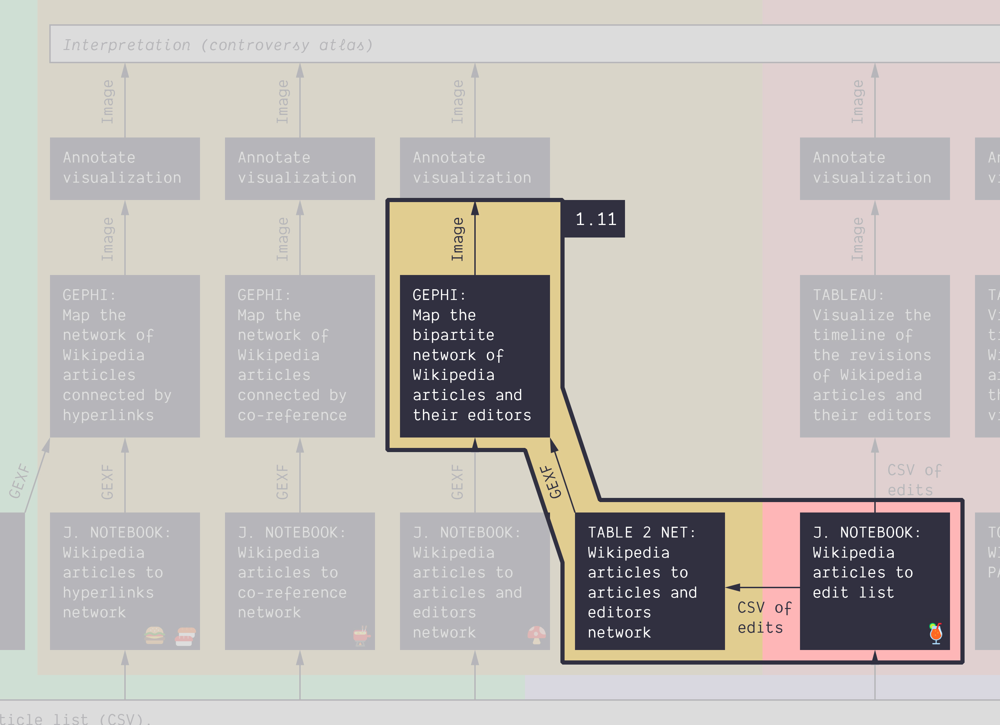

**Duration: 45 min**

**Goals**
* Check that one can **extract a network** from a table
* Learn how to use **Table2Net** (online tool)
* Activate your new network visualization skills
* Make an annotated network map

# Lorem Ipsum

# Next tutorial

You may want to take a short walk at this point. Then check this:

[1.12. Activate your knowledge about Gephi *45 min*](../1.12/)
