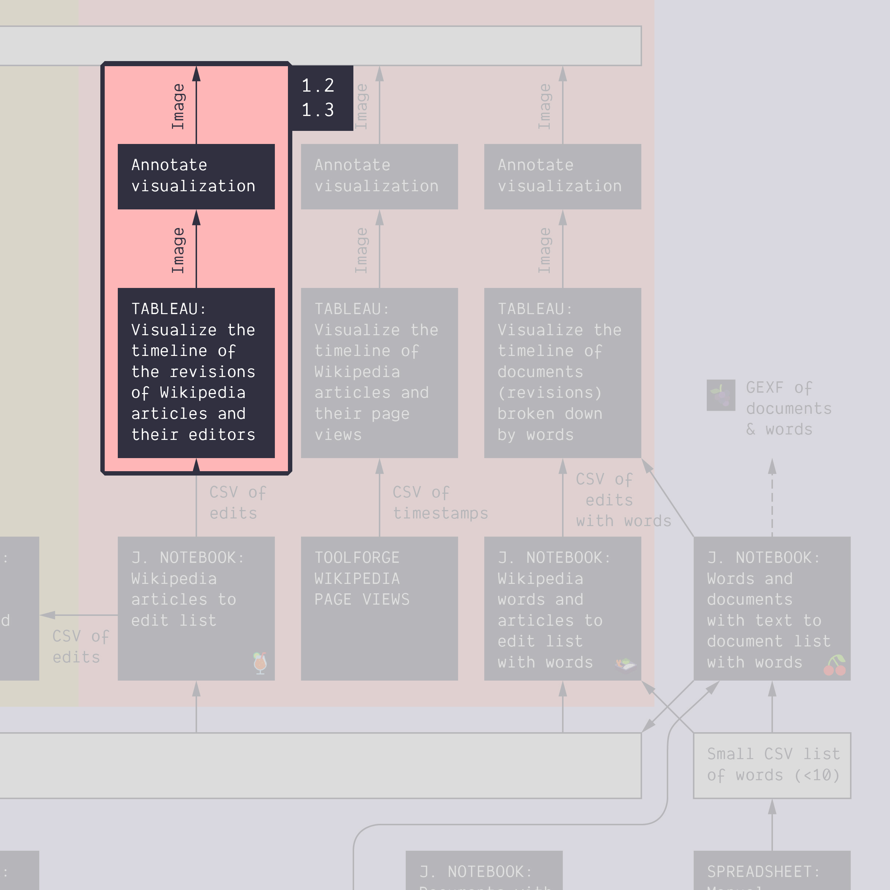

**Duration: 30 min**

**Goals**
* Check that different data tell a different story
* Try different visual models for different aspects of data
* Make another annotated visualization

# Case

We still focus on the topic of *energy conversion* using the same two Wikipedia articles:
* [Space-based solar power](https://en.wikipedia.org/wiki/Space-based_solar_power)
* [Thorium-based nuclear power](https://en.wikipedia.org/wiki/Thorium-based_nuclear_power)

# Data

Download this CSV:

<a href="../assets/data/1-2/wikipedia-edits-tuto-1.2.csv">
	<i class="fas fa-file-csv" style="font-size:5em"></i> 
	wikipedia-edits-tuto-1.2.csv
</a>  

It contains the list of edits (i.e. revisions) for these two pages. It has been produced by feeding this [<i class="fas fa-file-csv"></i> file](../assets/data/1-2/wikipedia-articles-tuto-1.2.csv) into this notebook: [🍹&nbsp;Wikipedia articles to edits list](https://colab.research.google.com/github/jacomyma/mapping-controversies/blob/main/notebooks/Wikipedia_articles_to_edits_list.ipynb), but we will see that in [tutorial 1.6](../1.6/).

# Video tutorial

Note: the file mentioned in this video is the one you just downloaded.



# Load your data into Tableau

Upload the data in the same way as in [tutorial 1.1](../1.1/), and take a look at it. There are more columns to choose from, so the complexity goes up. Notice for example that two columns, "Lattitude" and "Longitude", have now been parsed as geographical coordinates.

# Visualize a timeline of revisions

Simple things first. The idea is still to look at the history of these pages, like we did in the previous tutorial, but the question has changed. We are now interested in when they were *edited* the most, as opposed to when they were *viewed* the most. The result may look like this:

Note that you could also choose to drag "Size" or "User (Count (Distinct))" to the "Rows" field if you want to represent the size of revisions (number of characters added or removed) or number of users doing the revisions in a given month.

Again, remember that although this visualization looks a bit like that of [tutorial 1.1](../1.1/), the data represent something completely different (revisions instead of views) which prompts questions like:
* Is there a correlation between the number of views and the number of edits over time?
* Should we expect such correlation? Why or why not?
* Do the edits tell a different story than the views? And if that is the case, what is the story?

Also note that *revision* data goes further back in time than *views* data. This is because Wikipedia only started offering page views as a retrievable data point in 2015, whereas a record of all revisions is available from the platform's inception. What we see here is the start of two articles in 2006 and 2012 respectively.

# Annotate the timeline of revisions

Annotate the visualization like [previously](../1.1/):
* Export a static image from Tableau
* Import it into Google Slides
* Annotate the important features of the visualization
* Export the annotated image

This time, however, we have other options when it comes to interpreting the spikes. Besides exploring the news we can look at what the editors have been adding or removing in a given period of time. At the top of every Wikipedia page there is a tab named "View history". It allows you to explore the entire archive of revisions for that page.

If we [explore the page history for "Space-based solar power"](https://en.wikipedia.org/w/index.php?title=Space-based_solar_power&offset=&limit=500&action=history), for example, we can notice that many of the revisions that produce a spike in March 2017 were produced by a user called "Geogene" who have been editing references, cleaning up text, and adding information about launch costs. Note that you can select any two revisions in the tick boxes to the left of them and explore exactly what has been changed by clicking "Compare selected revisions" at the top of the list. Here is [an example of a March 2017 revision by Geogene](https://en.wikipedia.org/w/index.php?title=Space-based_solar_power&type=revision&diff=771513571&oldid=771512234) where a lot of text is being removed because it is seen to be too speculative about the potential of reusable rockets to reduce launch costs.

In some cases there appears to be a correlation between events reported in the news and revision activity on a Wikipedia page. In July 2011, for example, revision activity on "Space-based solar power" reaches its peak. This is the same month NASA launches its last space shuttle mission. A lot of the revision activity is focussed on launch systems and launch costs, such as [this section of the page on the possibility of builiding and launching satelites from a platform in space](https://en.wikipedia.org/wiki/Space-based_solar_power#Building_from_space)

Try to annotate some more spikes on the timelines by exploring and comparing revisions in the page history archive. Export the result as a static image from Google Sheets.
	

# Visualize a ranked list of revising editors 

<i class="fas fa-exclamation-circle"></i>&nbsp;Create each visualization in its own sheet, to combine them in the next tutorial.

The fact that revision data is richer that page views brings opportunities other kinds of visualization. As we have a column with the usernames of the editors, we can look into this. Let's visualize if some editors have contributed more than others. It may look like this:

# Visualize a geographical map of anonymous editors

We can also wonder where the editors live. It may look like this:

Be aware that when you drag "Lattitude" and "Longitude" into the "Columns" and "Rows" fields, Tableau may try to calculate an average and represent that. This will result in all editors being represented as a single node somewhere in the middle of the map. To fix it, you need to click on them in the "Column" and "Row" fields and select "Dimension" from the drop down.

Remark: not all editors have lattitude and longitude data. You can see that in the data table. This is because Wikipedia discloses the IP addresses of anonymous users and IP adressess can be be geo-located. In short, what we are visualizing here is the location of all the anonymous contributors. Tableau tells you, in the visualization, that some of the data points were not placed in the map. Did you see it?

# Documents produced

Keep the following files for later use:
* The annotated visualization (JPEG or PNG) 
* The Tableau workbook with the three worksheets (timeline of edits, ranked list of revising editors, geographical map of anonymous editors)

# Next tutorial

You deserve a break! Then head for the next tutorial:

[<i class="fas fa-forward"></i>&nbsp;1.3. Build a simple dashboard *(30 min)*](../1.3/)

---

### Relation to the course readings

* The intricacies of Wikipedia and the different ways in which the platform may be reappropriated for controversy analysis are covered in *Weltevrede, E., & Borra, E. (2016).* **Platform affordances and data practices: The value of dispute on Wikipedia**
*Big Data & Society, 3(1).*
