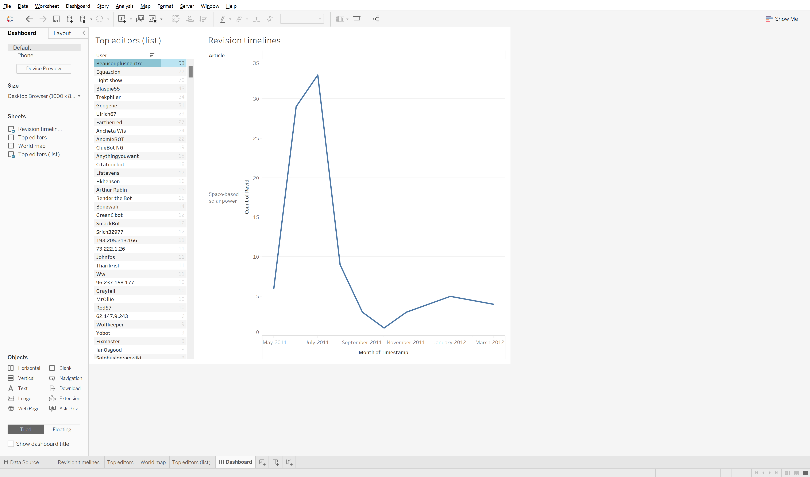
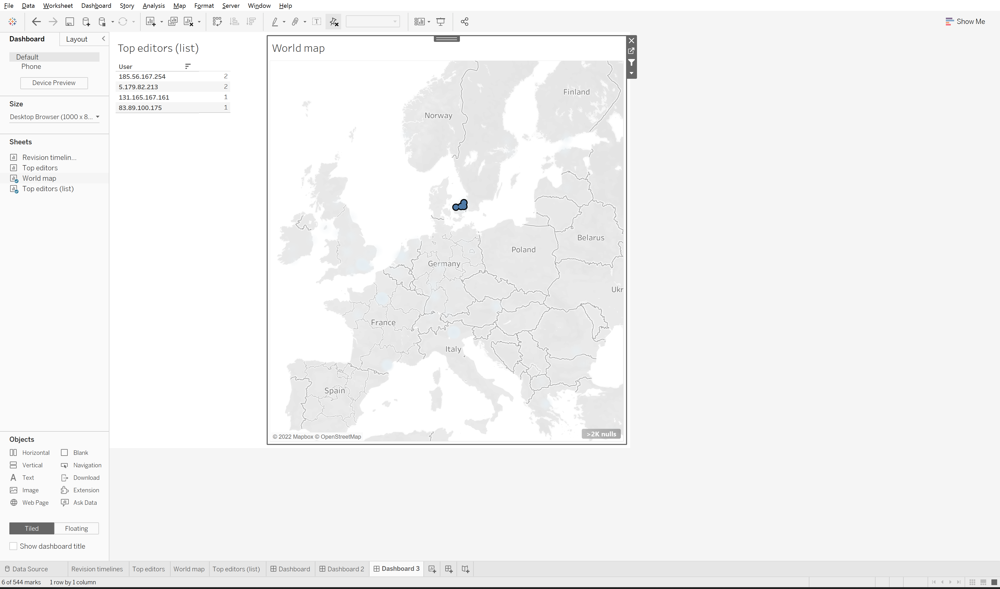
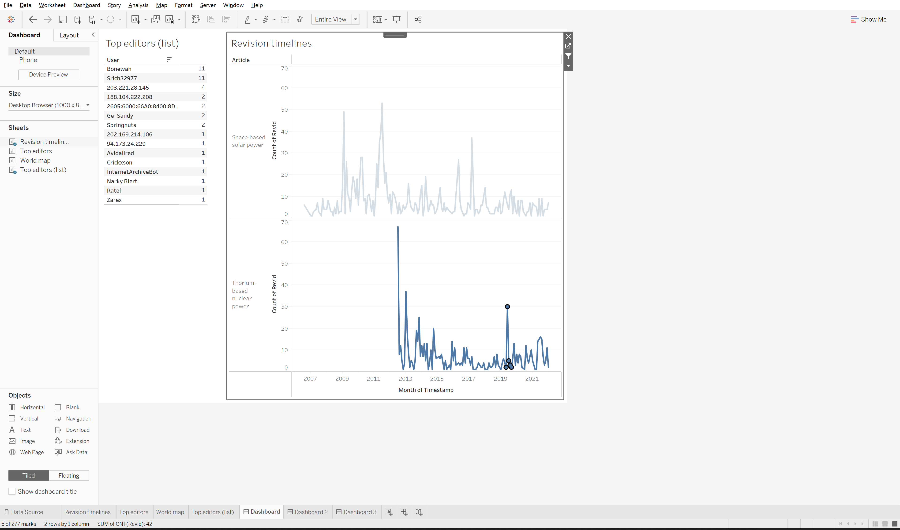

**Duration: 15 min**

**Goals**
* Make a **dashboard** with Tableau

# Make a dashboard

The dataset from the last tutorial ([1.2](../1.2/)) is rich enough to create a dashboard in Tableau. Let's do that by reusing the Tableau file of the last tutorial, and combining its visualizations.

How to create a dashboard:
* Click on the "New dashboard" icon at the bottom of the workbook.
* Drag the sheets you have created into the dashboard space: the timeline, geographical map, the list of editors... You may have to modify your sheets for the dashboard, because there is less space.
* Use some (or all) of the [sheets as filters](https://help.tableau.com/current/pro/desktop/en-us/dashboards_create.htm#add-interactivity) to enable interactive exploration.
* Check the [help](https://help.tableau.com/current/pro/desktop/en-us/dashboards_create.htm#create-a-dashboard-and-add-or-replace-sheets) if you're lost.

It may look like this:

Or like that:

# Explore the data by filtering the dashboard 

Explore the data with the dashboard. Filter in different ways to explore different aspects. Each question may require a specific kind of filtering, and therefore a dashboard with specific sheets.

# Make an annotated visualization

Pick a question that you can answer with the dashboard, and use it to annotate the visualization.

Example of questions you may use:
* Are there editors in Denmark? If so, who are they?
* Are there editors who edited both pages?
* Who edited during a spike?

You may draw inspiration from this:

# Documents produced

Keep somewhere, for sharing, the following document:
* The annotated visualization (JPEG or PNG)

# Next activity

[<i class="fas fa-forward"></i>&nbsp;1.4. A small-multiple with words *(30 min)*](../1.4/)

---

### Additional resources

* This [intro to Tableau in 23 minutes](https://www.youtube.com/watch?v=jEgVto5QME8) we mentionned before shows how to create a dashboard.