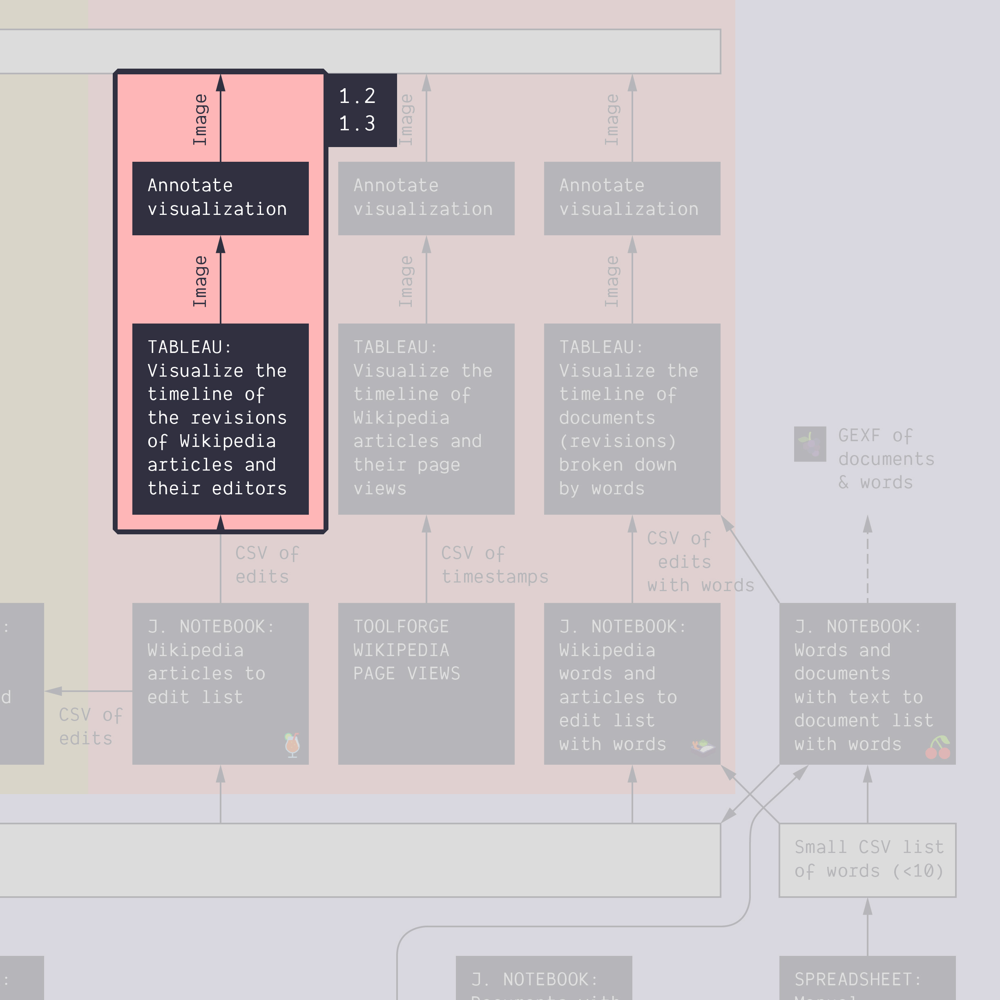
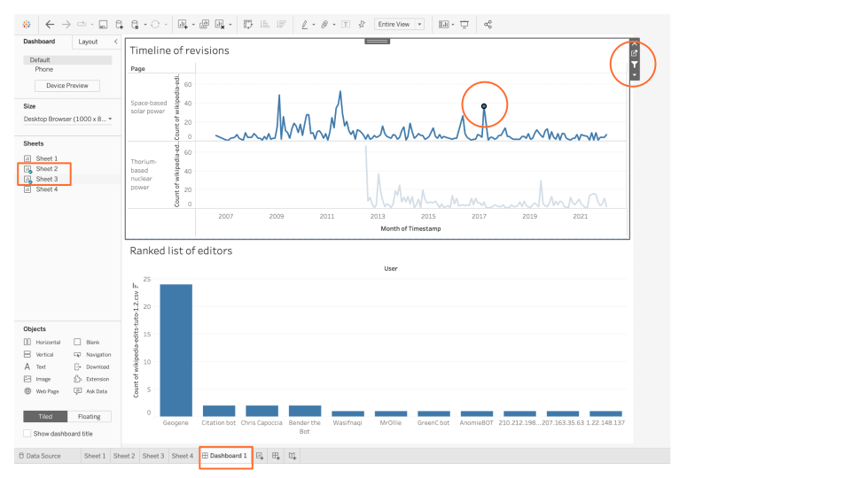
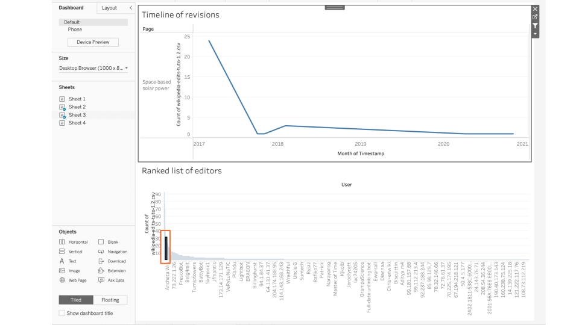
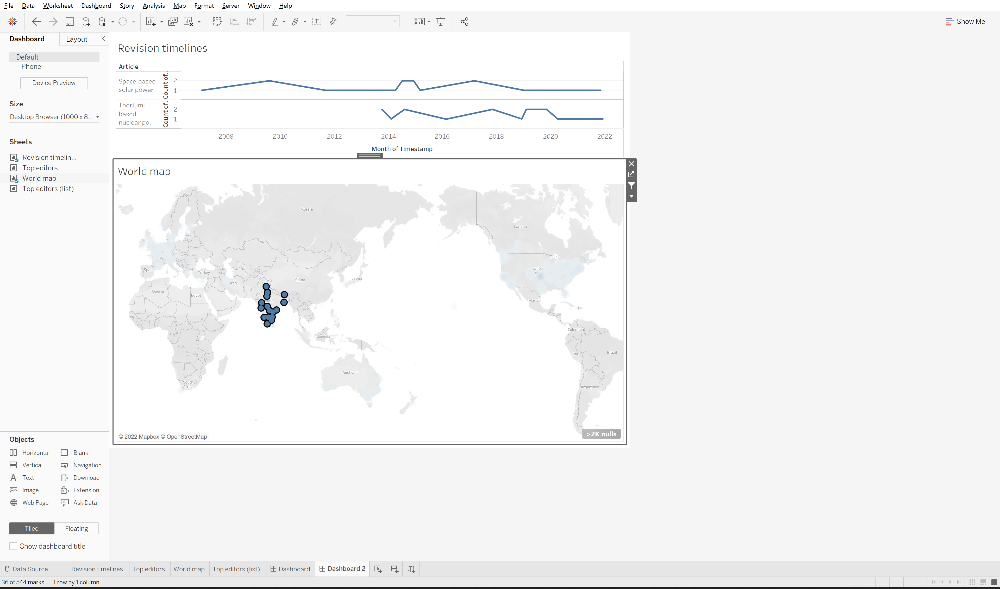

**Duration: 30 min**

**Goals**
* Make a **dashboard** with Tableau

# Video tutorial



# Make a dashboard

The dataset from the last tutorial ([1.2](../1.2/)) is rich enough to create a so-called dashboard in Tableau. A dashboard is a combination of visualizations that that allows the user to [filter the data by selecting parts of one visualization and observing changes to the other visualizations](https://help.tableau.com/current/pro/desktop/en-us/dashboards_create.htm#add-interactivity).

Let's do that by reusing the Tableau workbook from the previous tutorial and combining the visualizations we created.

How to create a dashboard:
* Click on the "New dashboard" icon at the bottom of the workbook.
* Drag the visualizations you want to combine from your list of worksheets on the left onto the dashboard canvas in the middle. 
* Select a visualization and click the small funnel-shaped icon in the top right corner to turn on filtering.
* You can now select any data point on that visualization and observe how the other visualizations on the dashboard adjust to the filtered dataset.

In the example below we combine the timeline of revisions with the ranked list of revising editors. When selecting the March 2017 spike in revisions for the "Space-based solar energy" page, the ranked list of revising editors below filters to only include data for that page and that month. Our finding from the previous tutorial that this revision spike is mainly driven by the user "Geogene" is now plain to see. 

Rather than browsing through the page history archive right away, we can quickly make similar findings for other spikes. This makes it easier to target our investigation on Wikipedia. "What exactly was "Geogene" doing in March 2017" is a more focussed question than "what happened in March 2017". We could also, as we have done below, activate the filter on the ranked list of editors instead and select "Geogene" to see the revision timeline of that user only. This will show us that "Geogene" is 1) only active on the "Space-based solar power" page and 2) only following the initial engagement around launch costs in March 2017. 

You can also try to make a dashboard with the timeline of revisions and the map of anonymous revising editors. 

It may look like this (here we have selected all the anonymous editors in India to explore their revision timeline - remember to activate the filter for the map):

* Make your own version of one the dashboards above and explore. You may have to modify your sheets since there is less space in the dashboad canvas than on your worksheets. 
* Check the [help](https://help.tableau.com/current/pro/desktop/en-us/dashboards_create.htm#create-a-dashboard-and-add-or-replace-sheets) if you're lost.

# Explore the data by filtering the dashboard 

Explore the data and try different filters.

# Make an annotated visualization

Formulate a question that you can answer with the dashboard and use it to annotate the visualization.

Example of questions you may use:
* Are there editors who edited both pages? If so, who are they?
* Who edited during a spike?
* Where in the world are the anoymous editors, that produce a given revision spike?

# Documents produced

Keep somewhere, for sharing, the following document:
* The annotated visualization (JPEG or PNG)

# Next activity

[<i class="fas fa-forward"></i>&nbsp;1.4. A timeline of words *(30 min)*](../1.4/)

---

### Additional resources

* This [intro to Tableau in 23 minutes](https://www.youtube.com/watch?v=jEgVto5QME8) we mentionned before shows how to create a dashboard.

### Relation to the course litterature

* The intricacies of Wikipedia and the different ways in which the platform may be reappropriated for controversy analysis are covered in *Weltevrede, E., & Borra, E. (2016).* **Platform affordances and data practices: The value of dispute on Wikipedia**
*Big Data & Society, 3(1).*