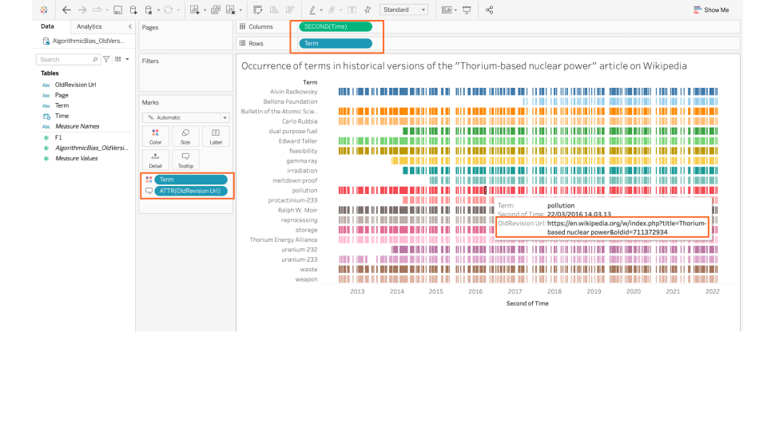

**Duration: 30 min**

**Goals**
* Make a timeline of *words* occurring in old versions of text
* Make a easy to *explore the source* directly from Tableau

# Data

Download this CSV:

<a href="../assets/data/1-4/terms-and-revisions-thorium.csv">
	<i class="fas fa-file-csv" style="font-size:5em"></i> 
	terms-and-revisions-thorium.csv
</a>  

It contains old revisions of the article about [Thorium-based nuclear power](https://en.wikipedia.org/wiki/Thorium-based_nuclear_power) with information about whether a set of user-defined keywords are present in each revision.

*Note: this file was obtained by feeding this [<i class="fas fa-file-csv"></i>&nbsp;list of terms](../assets/data/1-4/words-small-list-nuclear.csv) and this [<i class="fas fa-file-csv"></i>&nbsp;list of articles](../assets/data/1-4/article-thorium.csv) (with just one article!) into the following notebook: [🍱&nbsp;Wikipedia words and articles to edit list with words](https://colab.research.google.com/github/jacomyma/mapping-controversies/blob/main/notebooks/Wikipedia_words_and_articles_to_edit_list_with_words.ipynb)*.

# Visualize the words as a timeline
Begin by making a timeline that looks like this:

* **Import** the data into Tableau
* Make a **sheet** where "Time" is the columns (aggregated by seconds to ensure we get all revisions represented separately) and "Term" is the rows.
* Drag "Term" to the "Colour" field on the left of the sheet.
* Drag "OldRevision Url" to the "Tooltip" field. This will ensure that when you select a revision with a word on the timeline, the tooltip gives you a direct link to the old version of the Wikipedia page where the word is found.

You can read the visualization as a list of words that light up on the horizontal axis if they are found in an old revision of the Wikipedia page that was made at that point in time. 

# Annotate the dashboard

The words have been selected because they tell a story about the controversy. Try to work out the story by reading the [version of the page about thorium-based nuclear power](https://en.wikipedia.org/w/index.php?title=Thorium-based_nuclear_power&oldid=1070992053) where the words were selected from. 

You can use the link in the tooltip to explore the old revisions where the words occured first or where they were not yet there.

Like before, make an **annotated visualization** from your worksheet, by exporting it into Google Slides, adding information, then exporting an image.

# Make a dashboard if you have more time
Since we have a direct link to the old versions of the page in the dataset ("OldRevision Url") it is possible to make a dashboard that embeds a direct view of that page whenever a revision is selected on the timeline. 

It may look like this 

* Drag a "Web page" from the bottom left box onto the dashboard canvas along with the timeline.
* Then try to follow [these instructions](https://www.theinformationlab.nl/en/2020/09/17/tableau-how-to-embed-a-web-page-object-into-your-dashboard/) (or [those](https://www.rigordatasolutions.com/post/embedding-webpages-in-tableau-dashboards-opening-url-actions-inside-your-dashboards)).

# Documents produced

Keep somewhere, for sharing, the following document:
* The annotated visualization (JPEG or PNG)

# Next tutorial

☕ Coffee time! Rest your eyes, then head for the next tutorial:

[<i class="fas fa-forward"></i>&nbsp;1.5. Harvest a dataset *(15 min)*](../1.5/)

--- 

### Relation to the course readings

* The intricacies of Wikipedia and the different ways in which the platform may be reappropriated for controversy analysis are covered in *Weltevrede, E., & Borra, E. (2016).* **Platform affordances and data practices: The value of dispute on Wikipedia**
*Big Data & Society, 3(1).*
