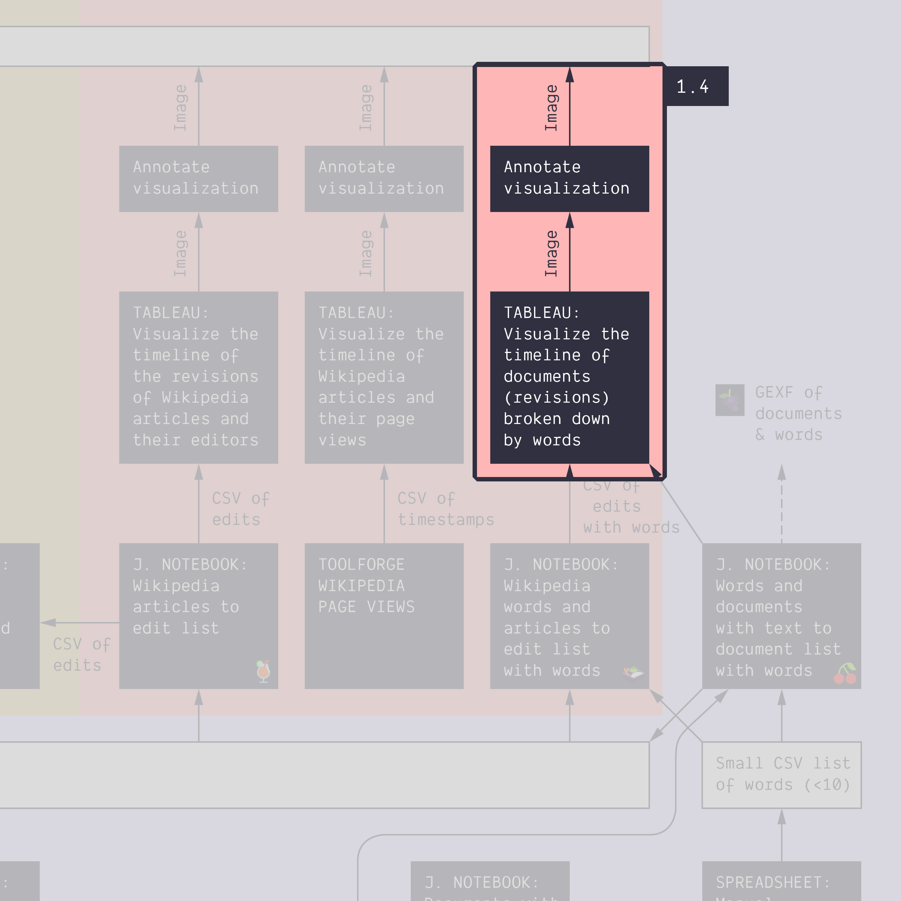

**Duration: 20 min**

**Goals**
* Make a timeline of *words* occurring in old versions of text
* Make a easy to *explore the source* directly from Tableau

# Data

Download this CSV:

<a href="../assets/data/1-4/terms-and-revisions-thorium.csv">
	<i class="fas fa-file-csv" style="font-size:5em"></i> 
	terms-and-revisions-thorium.csv
</a>  

It contains old revisions of the article about [Thorium-based nuclear power](https://en.wikipedia.org/wiki/Thorium-based_nuclear_power) with information about whether a set of user-defined keywords are present in each revision.

*Note: this file was obtained by feeding this [<i class="fas fa-file-csv"></i>&nbsp;list of terms](../assets/data/1-4/words-small-list-nuclear.csv) and this [<i class="fas fa-file-csv"></i>&nbsp;list of articles](../assets/data/1-4/article-thorium.csv) (with just one article!) into the following notebook: [🍱&nbsp;Wikipedia words and articles to edit list with words](https://colab.research.google.com/github/jacomyma/mapping-controversies/blob/main/notebooks/Wikipedia_words_and_articles_to_edit_list_with_words.ipynb)*.

# Visualize the words as a timeline
Begin by making a timeline that looks like this:

* **Import** the data into Tableau
* Make a **sheet** where "Time" is the columns (aggregated by seconds to ensure we get all revisions represented separately) and "Term" is the rows.
* Drag "Term" to the "Colour" field on the left of the sheet.
* Drag "OldRevision Url" to the "Tooltip" field. This will ensure that when you select a revision with a word on the timeline, the tooltip gives you a direct link to the old version of the Wikipedia page where the word is found.

# Make a dashboard

* Use them to make a **dashboard**
* Pick the **question(s)** you want to answer

# Annotate the dashboard

Like before, make an **annotated visualization** from your dashboard, by exporting it into Google Slides, adding information, then exporting an image.

# Documents produced

Keep somewhere, for sharing, the following document:
* The annotated visualization (JPEG or PNG)

# Next tutorial

☕ Coffee time! Rest your eyes, then head for the next tutorial:

[<i class="fas fa-forward"></i>&nbsp;1.5. Harvest a dataset *(15 min)*](../1.5/)
