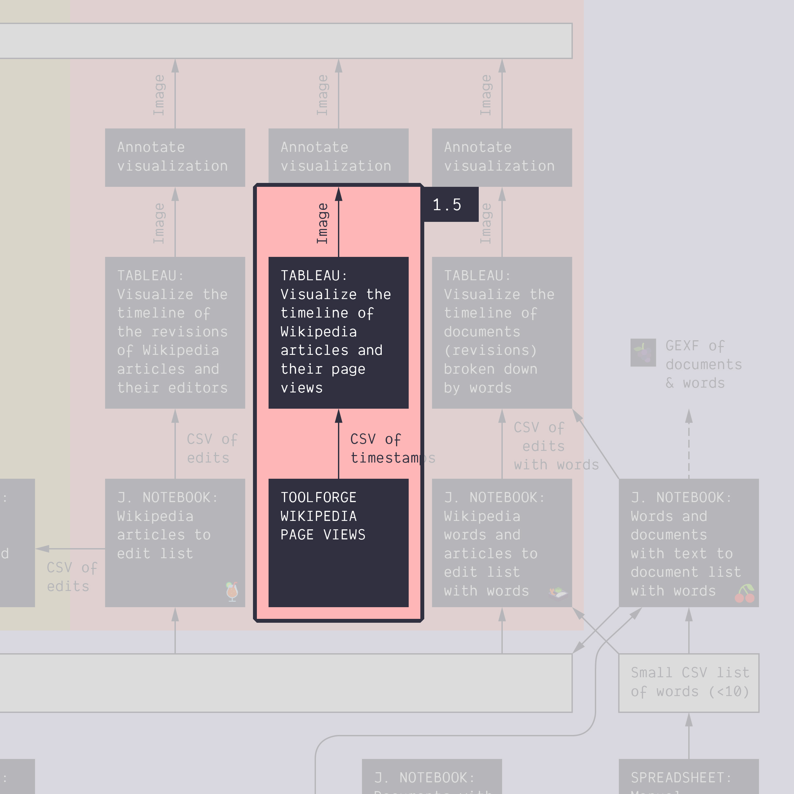
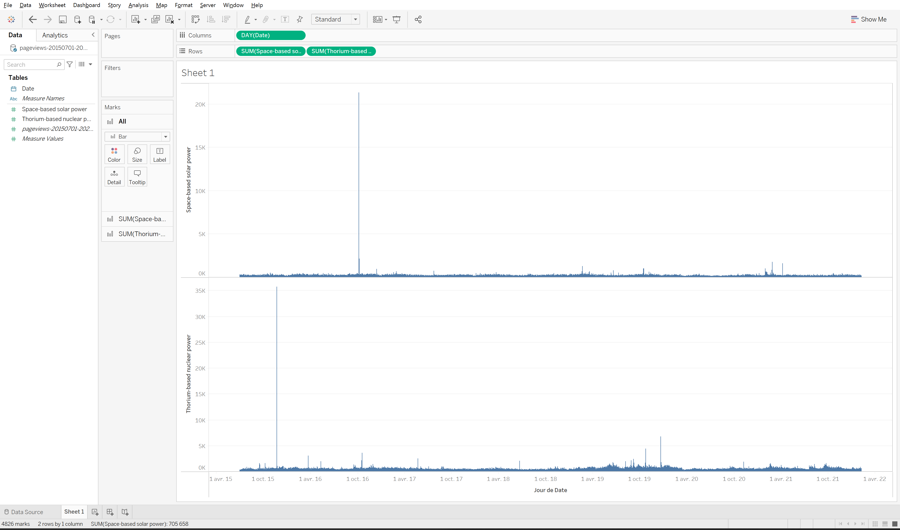

**Duration: 15 min**

[
	
](../assets/images/1-5.jpg)

**Goals**
* *Harvest* a dataset with a tool from an online source
* Know that the tool calls an API to get data

# Harvest a dataset

We will use Toolforge [PageViews](https://pageviews.toolforge.org) to harvest a the same dataset we have used to build the timeline of page views in [Tutorial 1.1](../1.1/).

* Go to [PageViews](https://pageviews.toolforge.org)
* Visualize the data for the two following Wikipedia articles:
	* ```Space-based solar power```
	* ```Thorium-based nuclear power```
* Use the right settings:
	* The ```Dates``` should be from 01/07/2015 to today (we used 06/02/2022)
	* The ```Date type``` should be ```Daily```. Indeed, Tableau can aggregate into months or years easily, so the more precise data is just better.
* Download the dataset by clicking on the ```Download``` drop-down menu and selecting ```CSV```.

The tool works by calling the Application Programming Interface (API) of Wikipedia. The [endpoint for page views](https://wikitech.wikimedia.org/wiki/Analytics/AQS/Pageviews) gives you more options than the tool is able to offer, but the tool makes it easy to interact with API. We will see in the next tutorial how to use script to call the API directly.

# Visualize

Open the dataset into Tableau and check that it works. Can you visualize it at the day level using bars? It may look like this:

[
	
](../assets/images/1-5/timeline.png)

<div class="notice--info"><b>TIP:</b> if the bars look grey, that is because they are so thin that we only see their grey border. If you want to remove that border, click on the <code>Color</code> button in the <code>Marks</code> panel and set <code>Borders</code> to <code>None</code>.</div>

No need to annotate this time (you've done it already in the [first tutorial](../1.1/)).

# Documents produced

This time, none!

# Next tutorial

[<i class="fas fa-forward"></i>&nbsp;1.6. Harvest data with a notebook *(30 min)*](../1.6/)

---

### Tools for getting similar data (CSV format with timestamps) from other sources:
* [Search interest over time with Google Trends](https://trends.google.com/trends/?geo=DK). Note that this can be filtered to geographical regions or other Google platforms such as YouTube, News or Shopping.
* [Acitivity on Twitter over time with Social Bearing](https://socialbearing.com/search/user). Note that the input can be a single user handle or a hashtag, but that hashtag activity is hard to get more than a week back.
* [Publication activity around a topic over time in scientific journals with Scopus](https://www.scopus.com/). Note that you will need to use your university login.
* [Activity on public Facebook pages over time with FacePager](https://github.com/strohne/Facepager). Note that you will need to install the software.

### Relation to the course readings

* The process of getting data through scraping, crawling and calling APIs is covered in **Chapter 6: Collecting and curating digital records** of *Venturini, T. & Munk, A.K. (2021). Controversy Mapping: A Field Guide.*
