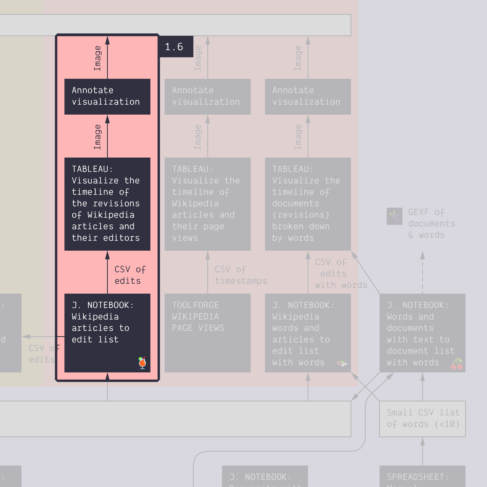
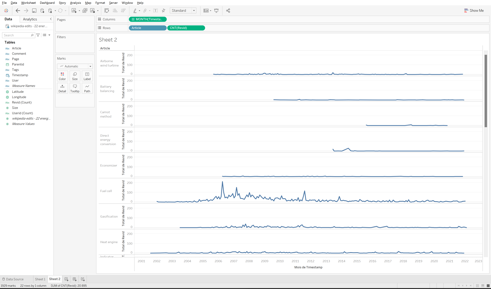
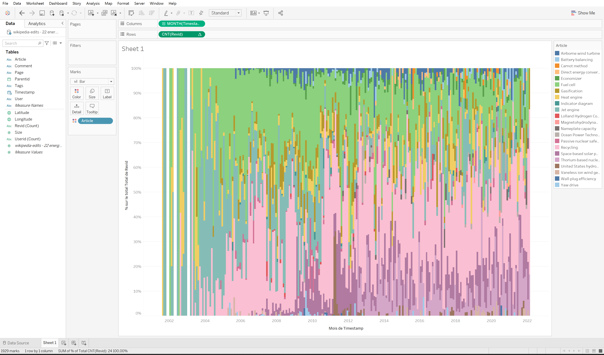
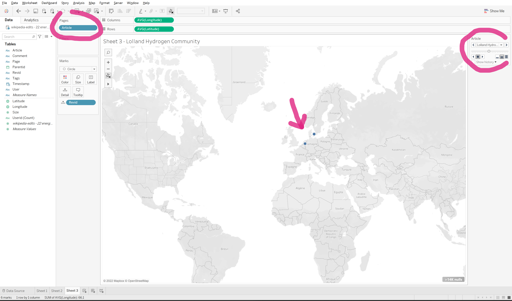

**Duration: 30 min**

[
	
](../assets/images/1-6.jpg)

**Goals**
* Learn how to run a **Jupyter notebook** from Google Colab
* Check that it works differently from previous tutorial
* Make an annotated visualization from this data

# Case

Still the topic of *energy conversion*, but this time using 22 articles.

# Data

Download this CSV:

<center><a href="../assets/data/1-6/wikipedia-articles - 22 energy conversion articles.csv">
	<i class="fas fa-file-csv" style="font-size:5em"></i><br>
	wikipedia-articles - 22 energy conversion articles.csv
</a><br><br></center>

It just contains a list of 22 articles about energy conversion. In fact, this list is just a small part of the articles about energy conversion, but we thought that it would be enough for now.

If you feel like it, you can try the [<i class="fas fa-file-csv"></i> list of 139 articles](../assets/data/1-6/wikipedia-articles - 139 energy conversion articles.csv) from the first level of the [Wikipedia category](https://en.wikipedia.org/wiki/Category:Energy_conversion). Expect the notebook to take about 10 minutes to run, then.

# Open the notebook in Google Colab

A bit of context:
* A *Jupyter notebook* is an online document that contains executable code (in Python), text, and images.
* Executing the code requires a computer. For instance your own computer with [Anaconda](https://docs.anaconda.com/anaconda/); but that is not what we will use.
* We will use [Google Colab](https://colab.research.google.com/), an environment proposed by Google, where the code is executed on a virtual machine. It requires a Google account.

We will use the following script. It opens directly in Colab (although it is actually [stored on GitHub](https://github.com/jacomyma/mapping-controversies/tree/main/notebooks)).

**[🍹&nbsp;Wikipedia articles to edits list](https://colab.research.google.com/github/jacomyma/mapping-controversies/blob/main/notebooks/Wikipedia_articles_to_edits_list.ipynb)**

*Note: the emoji of each notebook is just there to help you memorize which notebook does what.*

# Run the notebook to harvest data

* **Upload** the CSV data into the virtual machine. Click on the ```File``` icon on the left, then on the icon on top the reads ```Upload to session storage``` and upload the CSV from above.
* Read the notebook text itself, ```SETTINGS``` included, stopping at ```SCRIPT```. You are not expected to understand the code itself. Just what it does.
* **Edit the settings.** In particular, the name of the input file is probably not that indicated in the settings. You can change the variable in the settings, or rename the file in the virtual machine.
* **Run the notebook.** Each cell can be executed individually, but we recommend to run everything at once from the menu: ```Runtime > Run all```. It is done when the *last cell* outputs "Done".
* **Download** the output file from the virtual machine. First you to refresh the files of the virtual machine, in the side bar, by clicking on the ```Refresh``` icon. Then look for the output file, whose name was specified in the settings of the script, and download it via its drop-down menu, on the three dots on the right of the file.

You should obtain a file like [<i class="fas fa-file-csv"></i> this one](../assets/data/1-6/wikipedia-edits - 22 energy conversion articles.csv).

# Make an annotated visualization

The exercise is basically the same as tutorials [1.2](../1.2/) and [1.3](../1.3/), but this time you have more articles.

The tableau visualization may look like this...

[
	
](../assets/images/1-6/timeline.png)

...or maybe like that...

[
	
](../assets/images/1-6/stacked-timeline.png)

...and there are many other possibilities.

**The notebook allows dealing with bigger data, which unlocks new research questions.** You may pick one of those for your annotations:
* Are the articles synchronized or not? Are they edited at the same time?
* Are some articles older, more recent? *Note: would you look at the date of first edit, or something else?*
* Are there different moments where different articles get the most revisions?
* Are certain articles only edited in certain parts of the world?

**Tip:** you can use the ```Article``` dimension in Tableau's ```Pages``` shelf ([see help](https://help.tableau.com/current/reader/desktop/en-us/pages_shelf.htm)) to quickly compare across Articles.

[
	
](../assets/images/1-6/pages.png)

# Next tutorial

Last break before lunch! Then head for the last activity of the morning:

[<i class="fas fa-forward"></i>&nbsp;1.7. Activate your knowledge about Tableau *(45 min)*](../1.7/)

---

### Additional resources

* [Intro to Google Colab in 3 minutes](https://www.youtube.com/watch?v=inN8seMm7UI).

