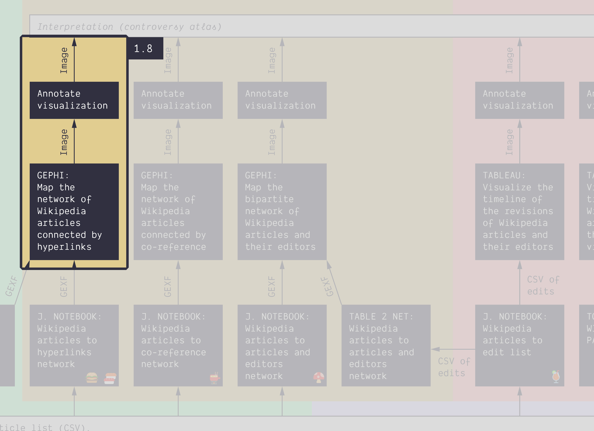

**Duration: 45 min**

[
	
](../assets/images/1-8.jpg)

**Goals**
* Learn how to use **Gephi**
* **Explore** a directed network
* Export a **network map**
* Annotate **clusters**

**You need**
* Gephi installed on your computer

# Data

Download this GEXF:

<center><a href="../assets/data/1-8/energy-conversion-wiki-cat-depth-1.gexf">
	<i class="fas fa-file" style="font-size:5em"></i><br>
	energy-conversion-wiki-cat-depth-1.gexf
</a><br><br></center>

It contains 787 Wikipedia pages about energy conversion (1 level of subcategories) connected by their hyperlinks.

*Note: you can obtain this network by getting all the pages of the category with the notebook [🍉&nbsp;Wikipedia category to article list](https://colab.research.google.com/github/jacomyma/mapping-controversies/blob/main/notebooks/Wikipedia_category_to_article_list.ipynb) then feeding that list into this other notebook: [🍣&nbsp;Wikipedia articles to hyperlinks network (slow and clean)](https://colab.research.google.com/github/jacomyma/mapping-controversies/blob/main/notebooks/Wikipedia_articles_to_hyperlinks_network_slow_and_clean.ipynb) (10 min to compute). With two levels of subcategories it gives 3,629 articles, which is a bit big for this tutorial. Here is the [<i class="fas fa-file"></i>&nbsp;file](../assets/data/1-8/energy-conversion-wiki-cat-full.gexf) though.*

# Check Gephisto

As an entry point to network visualization, you may try [Gephisto](https://jacomyma.github.io/gephisto/).

[
	
](https://jacomyma.github.io/gephisto/)

This tool makes a network map in one click, but as it cannot guess what you want, it takes decisions in your place. The result might not be that useful to you. You can always retry, though. You may obtain images like this one:

[
	
](../assets/images/1-8/gephisto-output.png)

Let's move to a more flexible tool: Gephi.

# Gephi video tutorials

**If you have not installed Gephi**, then watch this video and do it:



**Watch these two videos** about how to use Gephi to visualize a network (15 minutes total). You may want to try replicating what they do with the network you just downloaded.





# Visualize the network

Use Gephi to produce a network map. 

Apply the Force Atlas 2 algorithm with the default settings but two modifications:
* Stronger gravity activated
* Gravity set to 0.05

These modifications ensure that disconnected nodes ("islands") do not drift too far, which causes problems down the line.

<div class="notice--info"><b>Tip:</b> if the nodes jiggle too much, you can calm them down by lowering the <code>Tolerance (speed)</code> setting.</div>

You have to stop the algorithm manually when it has converged (just eyball that it does not significantly move anymore).

[
	
](../assets/images/1-8/gephi-01.png)

<div class="notice--warning"><i class="fas fa-exclamation-triangle"></i>&nbsp;Your node placement will differ because the layout is not deterministic.</div>

In the ```Statistics``` panel, run the ```Modularity``` algorithm with default settings. It detects clusters.

Color the nodes to highlight clusters visually. In the ```Appearance``` panel, click on the ```Nodes``` button, click on the ```Color``` icon (a palette), click on the ```Partition``` button, and in the drop-down list, pick ```Modularity Class```. Then click on the ```Apply``` button at the bottom of the panel. This colors each node according to the cluster detected by the modularity clustering algorithm.

[
	
](../assets/images/1-8/gephi-02.png)

<div class="notice--warning"><i class="fas fa-exclamation-triangle"></i>&nbsp;Your clusters will differ because the modularity clustering algorithm is not deterministic either.</div>

Set the node size as a function of the indegree (the number of edges coming from other nodes): in the ```Appearance panel```, click on the ```Nodes``` button, click on the ```Size``` icon (the three circles), click on the ```Ranking``` button, then in the drop-down list, select ```In-Degree```, set the ```Min size``` to ```3``` and the ```Max size``` to ```15```, then click on the ```Apply``` button.

[
	
](../assets/images/1-8/gephi-03.png)

## Bonus
If you feel comfortable, you may try doing the following:
* Generate a different color palette for the modularity class.
* Apply the Force Atlas 2 layout with the ```LinLog``` mode enabled, which will require you to drastically lower the ```Scaling``` and ```Gravity``` ratios.
* Apply the Force Atlas 2 layout with ```Prevent Overlap``` enabled as a finishing touch to separate the nodes better.
* Alternatively, assuming that the labels do not overlap too much, you may use the layout ```Label Adjust``` to unpack the labels artificially.
* Display node labels with the ```Size mode``` selector set to ```Node size``` (it's the black A in the bottom bar).

[
	
](../assets/images/1-8/gephi-04.png)

# Export an image

Let's export a PNG image of the network map.

* Go to the ```Preview``` page (third button on top of Gephi)
* In the drop-down list, pick the preset ```Default curved``` (curved edges are for directed networks)
* Click on the ```Refresh``` button on the bottom of the side panel

At this point you should see something like this:

[
	
](../assets/images/1-8/gephi-05.png)

Remark that there are so many labels that we cannot read them properly. We will mitigate the problem by changing the font size.

* In the ```Settings``` sidebar, under the ```Node Labels``` section, ensure that the ```Proportional size``` setting is enabled (bigger nodes have a bigger label)
* In the same section, in the ```Font``` row, click the button on the right labeled ```...```.
* Change to a smaller font size, click ```OK```, click on the ```Refresh``` button at the bottom of the sidebar, and check that it is good enough. Zoom the view if you need. The biggest nodes should be readable. If not, iterate. Some amount of overlap should be expected.

For us, ```Arial 4``` was good enough.

[
	
](../assets/images/1-8/gephi-06.png)

Then export the image as a PNG:
* Click on ```Export: SVG/PDF/PNG``` on the bottom-left of the screen
* Set a file name
* Select the file type ```PNG```
* Click on ```Options...``` and set a file size of ```2048px x 2048px```
* Save the file

You should obtain a file similar to that one:

[
	
](../assets/images/1-8/gephi-export.png)

<div class="notice--info"><b>Note:</b> it is perfectly acceptable to not show lables at all. Just uncheck <code>Show labels</code> in the settings. In this case, you need to add relevant labels as annotations later on.</div>

# Annotate the visualization

Import the exported image into Google Slide and **annotate the clusters**.

You may want to comment on:
* The relative size of the clusters
* The relative density of the clusters (densely packed, or sparse)
* The position of the clusters (on the size, on the periphery)
* The distance between the clusters, which relates to how connected they are. Are some clusters more intensely connected?

**Link these observations with the topic of energy conversion.** Clusters can be used to identify the subtopics of energy conversion. Are certain subtopics more important than others? In which way? Can you compare the subtopics?

Prioritize the most interesting observations in your annotations.

The beginning of an annotation could look something like this:

[
	
](../assets/images/1-8/MappingControversies_AnnotationExamples_FirstNetwork.svg)

You can find a [template here](https://docs.google.com/presentation/d/1sUoBD0Q0DjBOsV-lgFbvlVQIGF4gYfWbUN88iE-GUTQ/edit?usp=sharing) - feel free to make a copy and continue annotating, or simply start your own from scratch. 

# Documents produced

Keep somewhere, for sharing, the following document:
* The annotated network (JPEG or PNG)

# Next tutorial

Take a break before you get to this:

[<i class="fas fa-forward"></i>&nbsp;1.9. Visualize a bipartite network *(30 min)*](../1.9/)

### Relation to course readings

* The principles and concepts of Visual Network Analysis (VNA) are covered in **Chapter 2: What is visual network analysis** in *Jacomy, M. (2021). Situating Visual Network Analysis*
* And in **Chapter 7: Visual network analysis** in *Venturini, T. & Munk, A.K. (2021). Controversy Mapping: A Field Guide*
* The intricacies of Wikipedia and the different ways in which the platform may be reappropriated for controversy analysis are covered in *Weltevrede, E., & Borra, E. (2016).* **Platform affordances and data practices: The value of dispute on Wikipedia**
*Big Data & Society, 3(1).*
* A similar network is described in **Figure 48** of *Venturini, T. & Munk, A.K. (2021). Controversy Mapping: A Field Guide*:

[
	
](https://medihal.archives-ouvertes.fr/hal-03227362/image)
*Network of pages from the “Circumcision” category on Wikipedia connected by all hyperlinks between them. Pages about male circumcision group on the left (dark gray with white center), while pages about female circumcision (known here as female genital mutilation) group on the right (white with black center)*
