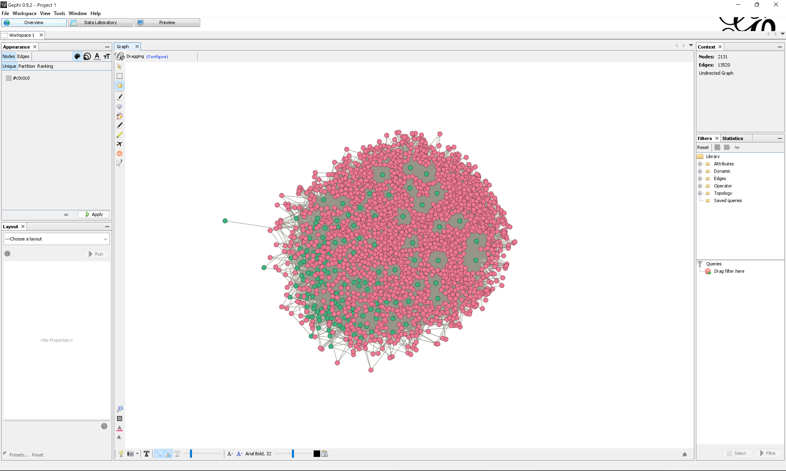

**Duration: 30 min**

[
	
](../assets/images/1-9.jpg)

**Goals**
* Visualize a **bipartite** network 
* Tinker with **centrality metrics**
* Annotate important nodes

# Data

Download this GEXF:

<center><a href="../assets/data/1-9/wikipedia-articles-editors-network.gexf">
	<i class="fas fa-file" style="font-size:5em"></i><br>
	wikipedia-articles-editors-network.gexf
</a><br><br></center>

It is the network of articles and editors connected when an editor contributed to one of the 139 Wikipedia articles in the category [energy conversion](https://en.wikipedia.org/wiki/Category:Energy_conversion) (ignoring subcategories).

The file was obtained by feeding this [<i class="fas fa-file-csv"></i>&nbsp;CSV file](../assets/data/1-9/energy-conversion-category-depth-0.csv) into the following script: [🍄&nbsp;Wikipedia articles to articles and editors network](https://colab.research.google.com/github/jacomyma/mapping-controversies/blob/main/notebooks/Wikipedia_articles_to_articles_and_editors_network.ipynb).

# Video tutorial

Check this tutorial first. It uses the data you just downloaded. Note that you will find the same instructions as text down below.



# Quickly visualize the network

Quickly visualize the network, and color the nodes according to the attribute ```type```. Do not waste too much time here. The network is **big** and we need to reduce it.

Remark the following:
* Each node can be one of two types: ```article``` or ```editor```
* Each edge connects an article to an editor. Contrary to the hyperlink network we saw in the previous tutorial, there are no edges between articles. And there are no edges between editors.
* The edges are not directed (you could say that an editor revises and article, or that an article is being revised by an editor, but contrary to the hyperlink it is not obvious what points to what here).

These are the features of a **bipartite** network.

Modularity clustering does not work well with bipartite networks, because their structure is generally not clusterized the same way. Instead, we will focus on centrality metrics.

[
	
](../assets/images/1-9/preview.png)


# Filter the network

99.67% of this network consists of editors. Unsurprising, as each article is edited by many people. We will remove the less interesting editors: the less connected ones.

Go to the ```Filters``` panel on the right, and locate the following filter:
```
Filters panel > Topology > Degree Range
```
Drag and drop this filter to the target icon just below, under ```Queries```. A subpanel dedicated to the filter will appear at the bottom.

In this subpanel, titled ```Degree Range Settings```, is a slider with two handles: it selects a range of values. Double-click on the left value (it displays ```1``` by default), input ```3``` and **hit ```enter```** (or it will not be taken into account).

Now click on the ```Filter``` button on the bottom-right. This should filter your network. Your panel should look like this:

[
	
](../assets/images/1-9/filter.png)

**What does it mean?** Filtering hides some nodes along with the edges connected to them. The filter we used only keeps nodes with a certain range of *degree*, that is a certain number of neighbors. Our settings kept only the nodes with 3 neighbors or more.

By doing this, we reduced the network to only 5.12% of the nodes, and 24.38% of the edges. It now has a more manageable size: 2,131 nodes and 13,520 edges.

Remark: filters acts on both types of nodes, editors and articles alike, but in this case, as articles have many neighbors, they were left untouched. We only removed editors.


# Apply a layout and save

We will now completely delete the hidden nodes to free up some computer power.
* Apply a layout if you want, as we will now save the network.
* In the menu, click on ```File > Export > Graph file...```.
* Choose the file type ```GEXF```.
* Click on ```Visible only``` in the bottom of the window.
* Name and save your file somewhere.

You can now quit Gephi, and reopen the exported file. You should see something like this:

[
	
](../assets/images/1-9/filtered-network.png)


In case something went wrong, here is the [<i class="fas fa-file"></i>&nbsp;filtered GEXF](../assets/data/1-9/wikipedia-articles-editors-network-filtered.gexf).


# Compute centrality metrics

In the ```Statistics``` panel, on the right, run ```Network diameter```.

The network diameter is how many edges there are between the two most distant nodes (in this case, you will find 5). But more importantly, at the same occasion, the article computes some *centrality metrics*, including:
* *Betweenness centrality*: the higher, the more the node is a bridge, a broker.
* *Closeness centrality*: the higher, the closer the node is, on average, to the other nodes.

Visualize these centrality metrics as node sizes. Here what it looks like, using sizes from 1 to 10.

**Closeness centrality**
[
	
](../assets/images/1-9/closeness.png)

**Betweenness centrality**
[
	
](../assets/images/1-9/betweenness.png)

Are those the same? Does it change anything that a node is an article or an editor?

# Annotate a visualization

The betweenness centrality network is the most interesting one. Export the network map and annotate it in Google Slides.

We ask you to **annotate the nodes that are important** (ingore the clusters for now). Here are some tips:
* High betweenness centrality means that the node is a bridge, an intermediary between many other nodes, or in other words a *broker*, an obligatory passage point.
* Since this network is bipartite, one can say that the brokers are the nodes that contribute the most to connecting the other type of nodes. In that sense, they are structurally important. For example, the editors with the highest betweenness centrality are those who contribute the most to *connecting* articles.
* In this network, each *connection* corresponds to a revision, i.e. the *act of editing* an article.
* So broker editors are those who contribute to the most varied articles, and broker articles are where the contributors are the most varied.

Make sure that your annotations are properly formulated to reflect the nature of the data.

# Documents produced

Keep somewhere the following somewhere for sharing:
* The annotated network (JPEG or PNG)

# Next tutorial

[<i class="fas fa-forward"></i>&nbsp;1.10. Visualize a weighted network *(15 min)*](../1.10/)

---

### Relation to the course readings

* The intricacies of Wikipedia and the different ways in which the platform may be reappropriated for controversy analysis are covered in *Weltevrede, E., & Borra, E. (2016).* **Platform affordances and data practices: The value of dispute on Wikipedia**
*Big Data & Society, 3(1).*
* The principles and concepts of Visual Network Analysis (VNA) are covered in **Chapter 2: What is visual network analysis** in *Jacomy, M. (2021). Situating Visual Network Analysis*
* And in **Chapter 7: Visual network analysis** in *Venturini, T. & Munk, A.K. (2021). Controversy Mapping: A Field Guide*
