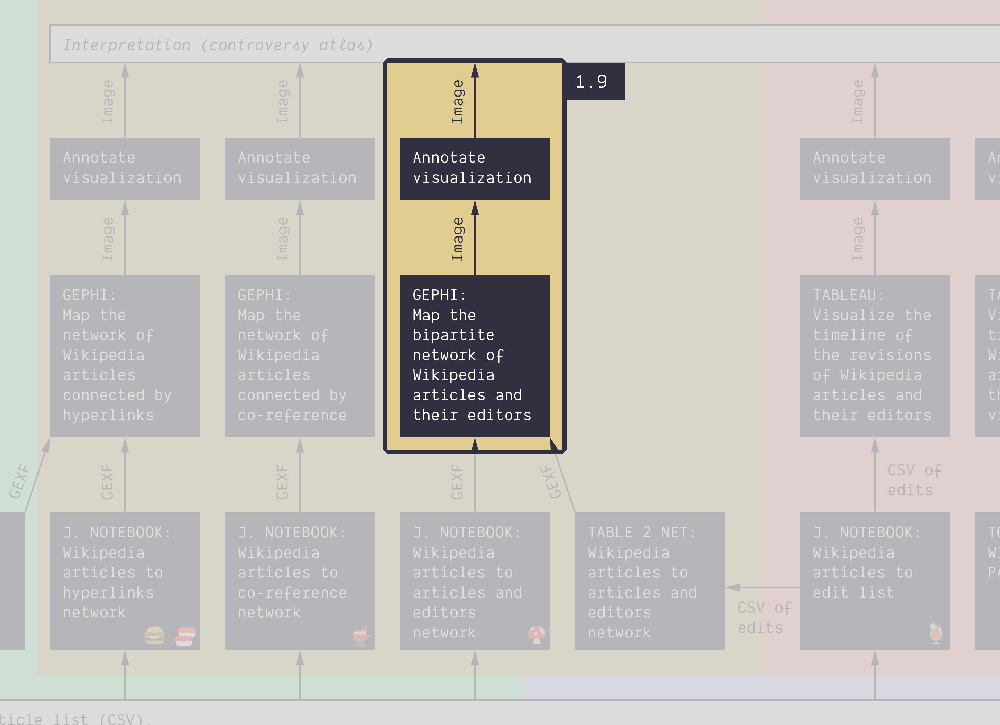

**Duration: 25 min**

[
	
](../assets/images/1-9.jpg)

**Goals**
* Check what makes a **bipartite** network special
* Experiment with Gephi's **data laboratory**
* Tinker with **centrality metrics**
* Annotate important nodes

# Data

Download this GEXF:

<center><a href="../assets/data/1-9/wikipedia-articles-editors-network.gexf">
	<i class="fas fa-file" style="font-size:5em"></i><br>
	wikipedia-articles-editors-network.gexf
</a><br><br></center>

This file was obtained by feeding this [<i class="fas fa-file-csv"></i>&nbsp;CSV file](../assets/data/1-9/energy-conversion-category-depth-0.csv) containing the 139 Wikipedia articles in the category about energy conversion (ignoring subcategories) into the following script: [🍄&nbsp;Wikipedia articles to articles and editors network](https://colab.research.google.com/github/jacomyma/mapping-controversies/blob/main/notebooks/Wikipedia_articles_to_articles_and_editors_network.ipynb).

# Quickly visualize the network

Quickly visualize the network, and color the nodes according to the attribute ```type```. Do not waste too much time here. The network is **big** and we need to reduce it.

Remark the following things about this network:
* Each node has one of the following types: ```article``` or ```editor```
* Each edge connects an article to an editor. Contrary to the hyperlink network we have seen before, there are no edges between articles. And there are no edges between editors.
* The edges are not directed

These are the features of a **bipartite** network.

Modularity clustering does not work well with bipartite networks, because their structure is generally not clusterized the same way. Instead, we will focus on centrality metrics.

[
	
](../assets/images/1-9/preview.png)


# Filter the network

99.67% of this network consists of editors. Unsurprising, as each article is edited by many people. We will remove the less interesting editors: the less connected ones.

Go to the ```Filters``` panel on the right, and locate the following filter:
```
Filters panel > Topology > Degree Range
```
Drag and drop this filter to the target icon just below, under ```Queries```. A subpanel dedicated to the filter will appear at the bottom.

In this subpanel, titled ```Degree Range Settings```, is a slider with two handles: it selects a range of values. Double-click on the left value (it displays ```1``` by default), input ```3``` and **hit ```enter```** (or it will not be taken into account).

Now click on the ```Filter``` button on the bottom-right. This should filter your network. Your panel should look like this:

[
	
](../assets/images/1-9/filter.png)

**What does it mean?** Filtering hides some nodes along with the edges connected to them. The filter we used only keeps nodes with a certain range of *degree*, that is a certain number of neighbors. Our settings kept only the nodes with 3 neighbors or more.

By doing this, we reduced the network to only 5.12% of the nodes, and 24.38% of the edges. It now has a more manageable size: 2,131 nodes and 13,521 edges.

Remark: filters acts on both types of nodes, editors and articles alike, but in this case, as articles have many neighbors, they were left untouched. We only removed editors.


# Apply a layout and save

We will now completely delete the hidden nodes to free some computer power.
* Apply a layout if you want, as we will now save the network.
* In the menu, click on ```File > Export > Graph file...```.
* Choose the file type ```GEXF```.
* Click on ```Visible only``` in the bottom of the window.
* Name and save your file somewhere.

You can now quit Gephi, and reopen the exported file. You should see something like this:

[
	
](../assets/images/1-9/filtered-network.png)


In case something went wrong, here is the [<i class="fas fa-file"></i>&nbsp;filtered GEXF](../assets/data/1-9/wikipedia-articles-editors-network-filtered.gexf).


# Compute centrality metrics


# Next tutorial

[<i class="fas fa-forward"></i>&nbsp;1.10. Visualize a weighted network *(20 min)*](../1.10/)
