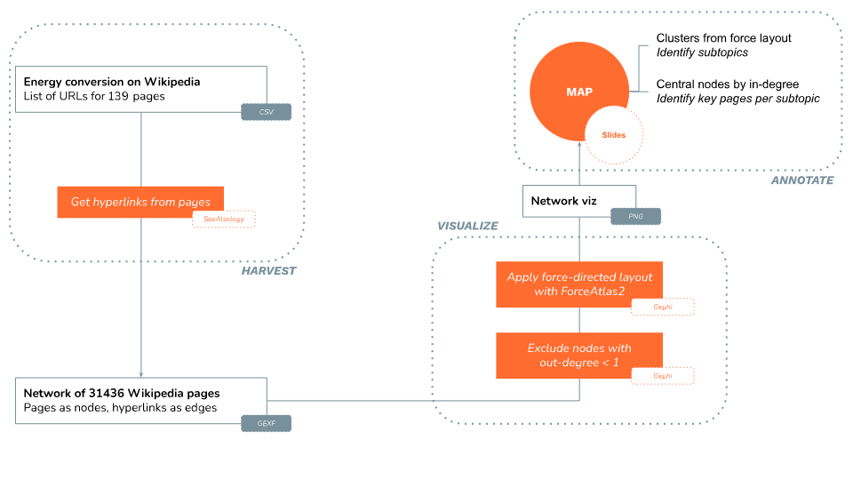

**Duration: 15 min**

[
	
](../assets/images/2-1 2-2.jpg)

**Goals**
* Discover **SeeAlsology**
* Export a network
* Check what a **protocol** looks like

# Case

We still stick to the case of energy conversion, using Wikipedia as the main data source.

# Protocol

Take a close look at this protocol:

[
	
](../assets/images/2-1/Protocol_Tutorial2-1.svg)

* The protocol tries to summarize all the information you need to understand the data and/or reproduce the analysis
* It mentions the tools and the data formats, but also the **most relevant settings**. Notably, when data have been removed.
* The main purpose of the protocol is to **provide context** to interpret the results.
* How to know what to feature in the protocol? Anything that is necessary to **reproducing** the process. Because then it means that it partially determined the result, and thus is necessary to understand it.

<div class="notice--info">In the following tutorials, we will alternate between following protocols and writing them. Ultimately, the goal is to learn how to write a protocol as an important and necessary part of a digital methods project. </div>

A [template for writing protocols is available here](https://docs.google.com/presentation/d/1pnV8ofxUogb9dKgiBzVuXDI5C1hk3A3WXgHo3HRdWug/edit?usp=sharing). Feel free to use it in the following tutorials.

# Data

Download this CSV:

<center><a href="../assets/data/2-1/wikipedia-URL-energy-conversion.csv">
	<i class="fas fa-file-csv" style="font-size:5em"></i><br>
	wikipedia-URL-energy-conversion.csv
</a><br><br></center>

It contains 139 Wikipedia page URLs about energy conversion (no subcategories included). As you have seen, this file is the starting point of the protocol.

<div class="notice">Contrary to a similar file we have seen in a previous tutorial, this one contains page URLs, not titles. It also has no header. This is what SeeAlsology needs.</div>

# SeeAlsology

[SeeAlsology](https://densitydesign.github.io/strumentalia-seealsology/) is an online tool that builds a network of Wikipedia pages and their hyperlinks. By default, it only looks at the hyperlinks in the "See also" section at the bottom of a Wikipedia page, hence its name. But it has a setting to grab all hyperlinks (we will use it).

* Open [SeeAlsology](https://densitydesign.github.io/strumentalia-seealsology/) in a browser
* Open the CSV file in a spreadsheet or text editor, and copy-paste the list of URLs into SeeAlsology
* Use these settings:
	* ```Distance```: ```0``` (this will ensure that the tool only gets hyperlinks from the pages you input)
	* ```Parent links```: ```Unchecked``` (this will ensure that the tool only gets links from the pages you input)
	* ```Take all links```: ```Checked``` (this will ensure that the tool gets all links found anywhere on the pages you input)

Wait, **are you sure you have used the right settings?**

Good, now you can click on ```Start crawling```.

Observe how the network grows as the tool works its way through the 139 seed pages.

When the tool is done you can download the resulting network as a .GEXF file. If this did not work you can find a version of the result [<i class="fas fa-file"></i>&nbsp;here](../assets/data/2-1/seealsology-network.gexf).

# Visualize in Gephi

Open the resulting network in Gephi and observe the following:
* There are much more nodes in this network than in the one you did in [tutorial 1.8](../1.8/) on a similar dataset. This is because SeeAlsology includes the next layer of pages that have been "seen" from the seed pages. The seed pages are coloured red and the "seen" pages are coloured blue.
* To remove the pages that are not in the seeds, we can filter the network by outdegree. Set the minimum to 1 and filter - this will ensure that only pages that have been scraped for outlinks are included.

# Check the protocol

Check that you have followed the protocol. **You do not have to do the "ANNOTATE" part** in this tutorial and those that come after, except the last one. Keep in mind, however, that featuring the annotation in the protocol is a good practice.

# Documents produced

Keep somewhere, for sharing, the following document:
* The (unannotated) network map (JPEG, PNG or PDF)

# Next tutorial

[<i class="fas fa-forward"></i>&nbsp;2.2. Write the protocol: scrape from one article with SeeAlsology *(30 min)*](../2.2/)

---

### Relation to the course readings

* The process of getting data through scraping, crawling and calling APIs is covered in **Chapter 6: Collecting and curating digital records** of *Venturini, T. & Munk, A.K. (2021). Controversy Mapping: A Field Guide.*
* The intricacies of Wikipedia and the different ways in which the platform may be reappropriated for controversy analysis are covered in *Weltevrede, E., & Borra, E. (2016).* **Platform affordances and data practices: The value of dispute on Wikipedia**
*Big Data & Society, 3(1).*
* The principles and concepts of Visual Network Analysis (VNA) are covered in **Chapter 2: What is visual network analysis** in *Jacomy, M. (2021). Situating Visual Network Analysis*
* And in **Chapter 7: Visual network analysis** in *Venturini, T. & Munk, A.K. (2021). Controversy Mapping: A Field Guide*

### Tools for getting similar data (networks in GEXF or GDF format) from other sources:

* Networks of users, hashtags, or emojis from Twitter with the [Twitter Streaming Importer plugin for Gephi](https://github.com/seinecle/gephi-tutorials/blob/master/src/main/asciidoc/en/plugins/twitter-streaming-importer-en.adoc). Takes a list of words/#tags or a list of users as input.
* Networks of YouTube channels or YouTube videos connected by their relatedness (as meassured by the algorithmic recommendations) with the [YouTube Data Tools](https://tools.digitalmethods.net/netvizz/youtube/). Takes a list of video or channel ID's as input.
* Networks of scientific publications connected through keywords or citations with [ScienceScape](http://medialab.github.io/sciencescape/). Takes a full export from Scopus as input.