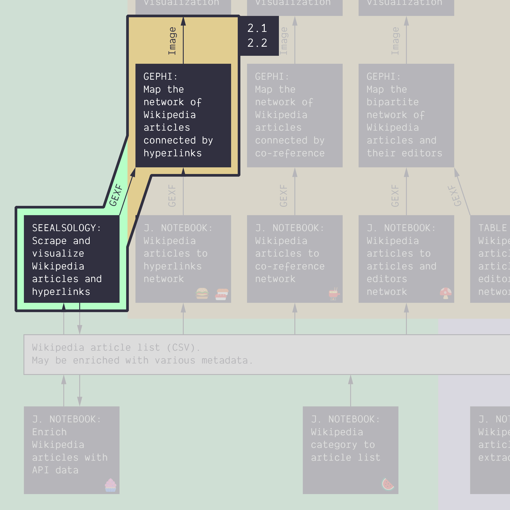

**Duration: 30 min**

[
	
](../assets/images/2-1 2-2.jpg)

**Goals**
* **Harvest your own network** with SeeAlsology
* Know that the tool uses a compbination of scraping and API calls to get hyperlinks and then crawl them.
* Make a choice about how to harvest the network (which settings)
* Explore the result with Gephi
* **Write up your protocol**

# Case

**Your choice!** Pick one Wikipedia article. Prioritize a topic that:
* You are curious about
* Is linked to a controversy you want to map
* An article that is not too long, *or* that has a good "See also" section.

*Still no idea? Try [this one](https://en.wikipedia.org/wiki/Copenhagen).*

# Harvest a network with SeeAlsology

* Open [SeeAlsology](https://densitydesign.github.io/strumentalia-seealsology/)
* Copy-paste the URL of the Wikipedia article of your choice
* Harvest a network

You should ask yourself the following questions, probably in this order:
* Do I want all the links, or just the "See also" links at the bottom of the page? Check or uncheck the ```Take all links``` setting. If you want all the links, SeeAlsology will simply call the [links endpoint of the Wikipedia API](https://www.mediawiki.org/wiki/API:Links) and ask for the information directly. If you only want the "See also" links, the tool will have to [ask the API for the page content](https://www.mediawiki.org/wiki/API:Get_the_contents_of_a_page), then identify the "See also" section and scrape it for links.
* Do I want to harvest links backwards (pages that cite my article but are not necessarily by my article)? If so, enable ```Parent links```. Since these links cannot be seen from the article you input, the tool cannot scrape anything and has to [rely on the API to get information about backlinks](https://www.mediawiki.org/wiki/API:Backlinks).
* How far should I go? That is, how many link steps will you allow the tool to navigate from the seed page you have inputted? The tool works as a crawler and is able to repeat the process of getting links everytime it finds new the pages. This process is called crawling and in crawler terminology maximu number of linksteps from the seed is called ```Distance```. **Tip:** start with short distances to keep the harvest managable.
* Do I want to filter the nodes later on in Gephi? Possibly because there are too many poorly connected nodes...

These questions have no obvious answer. They depend on your article and your interests. Some articles do not have a "See also" section, so it forces you to take all links. Some articles cite many other articles, so the network grows too fast and you must pick a low distance. Some articles have many parent articles, some none, etc.

*How to decide:* Look at a network size that is feasible. Too big, and it will get slow or impossible to work with your network. Too small, and there will be nothing to interpret. Aim for a size that you are comfortable with. Maybe 100 to 1,000 nodes? It also depends on the performance of your computer!

***Remark:** By definition, a distance of 0 gives you just your starting article. Similarly, a distancce of 1 gives you the starting article and its neighbors, but not the links between them (a star-shaped network). So you probably need a distance of 2 or more.*

**Tip:** If your starting page has enough "See also" links, then you do not take all the links, you might get a nice network with high distances (3 or more).

**Tip:** If you harvested all the links, then you probably need to filter your network in Gephi.

This is the network obtained for the article [Copenhagen](https://en.wikipedia.org/wiki/Copenhagen) with a depth of 3, with parent links, see-also links only. Here is the [<i class="fas fa-file"></i>&nbsp;GEXF](../assets/data/2-2/see-also-copenhagen.gexf), by the way.

[
	
](../assets/images/2-2/see-also-copenhagen.png)

# Visualize in Gephi

* Export the GEXF from SeeAlsology (under the drop-down button ```Download```).
* Visualize it in Gephi. You may have to filter out some nodes if it's too hairy...
* Export the PNG (no need to annotate, though)

# Write the protocol

Using Google Slides, write the protocol of the image you have produced. **It must feature the methodological decisions you have made in SeeAlsology.** You can copy [this template](https://docs.google.com/presentation/d/1pnV8ofxUogb9dKgiBzVuXDI5C1hk3A3WXgHo3HRdWug/edit?usp=sharing) and edit your own.

# Documents produced

Keep somewhere, for sharing, the following documents:
* The image of the network map (JPEG or PNG)
* The image of the protocol (JPEG or PNG)

# Next tutorial

[<i class="fas fa-forward"></i>&nbsp;2.3. Follow the protocol: co-reference network from a category *(15 min)*](../2.3/)

...but first, let's take a break.

---


### Tools for getting similar data (networks in GEXF or GDF format) from other sources:

* Networks of users, hashtags, or emojis from Twitter with the [Twitter Streaming Importer plugin for Gephi](https://github.com/seinecle/gephi-tutorials/blob/master/src/main/asciidoc/en/plugins/twitter-streaming-importer-en.adoc). Takes a list of words/#tags or a list of users as input.
* Networks of YouTube channels or YouTube videos connected by their relatedness (as meassured by the algorithmic recommendations) with the [YouTube Data Tools](https://tools.digitalmethods.net/netvizz/youtube/). Takes a list of video or channel ID's as input.
* Networks of scientific publications connected through keywords or citations with [ScienceScape](http://medialab.github.io/sciencescape/). Takes a full export from Scopus as input.

### Relation to the course readings

* The process of getting data through scraping, crawling and calling APIs is covered in **Chapter 6: Collecting and curating digital records** of *Venturini, T. & Munk, A.K. (2021). Controversy Mapping: A Field Guide.*
* The intricacies of Wikipedia and the different ways in which the platform may be reappropriated for controversy analysis are covered in *Weltevrede, E., & Borra, E. (2016).* **Platform affordances and data practices: The value of dispute on Wikipedia**
*Big Data & Society, 3(1).*
* A similar network is described in **Figure 47** of *Venturini, T. & Munk, A.K. (2021). Controversy Mapping: A Field Guide*:

[
	
](https://medihal.archives-ouvertes.fr/hal-03227358/image)
*Network obtained by crawling the “Circumcision controversies” page on Wikipedia at crawl distance 1 while also calling Wikipedia’s API to find pages through backlinks. Pages that are only found through backlinks are labeled*