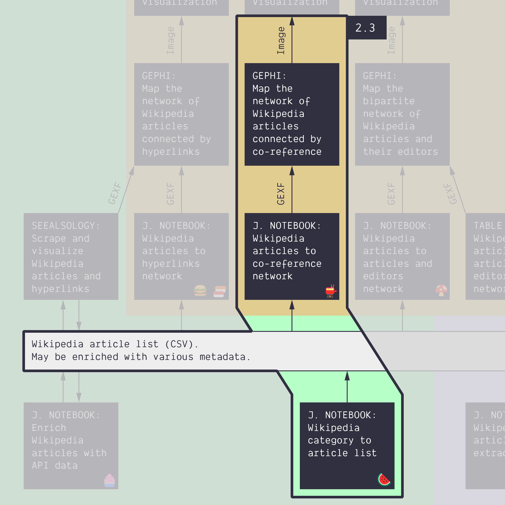
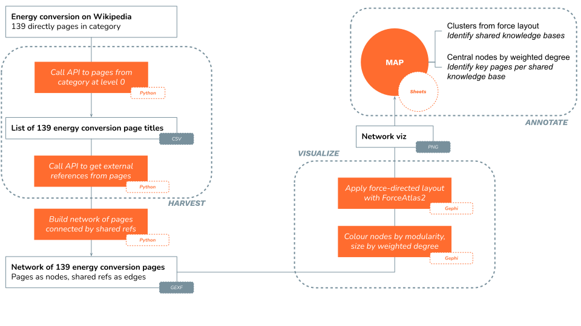

**Duration: 15 min**

[
	
](../assets/images/2-3.jpg)

**Goals**
* Check **two new Jupyter notebooks**
* Check how **Wikipedia categories** can be repurposed to get data
* **Harvest** a co-reference network from a Wikipedia category
* Follow a more complex protocol

# Datum

The only data we need is this single bit of text:

```
Category:Energy conversion
```

This is just the title of the [Wikipedia category on energy conversion](https://en.wikipedia.org/wiki/Category:Energy_conversion). It's nevertheless a *datum* (singular of data)!

A category on Wikipedia is a collection of pages about a specific topic curated by the editors. Notice that there are subcategories inside the category. This means that some pages are found directly in the category, while other pages that might still be topically relevant are found at deeper levels of subcategories. Level 0 would be pages found directly in the category, while level 2 would be pages found inside a subcategory of a subcategory of the category. We will make use of that to control the harvest below.

# Protocol

Here is the protocol (you can skip the annotation as you have already done something similar in Tutorial 1.10):

[
	
](../assets/images/2-3/Protocol_Tutorial2-3.svg)


Follow these instructions:
* Harvest the Wikipedia articles listed in a Wikipedia category
	* The Wikipedia category is *energy conversion*
	* Use a ```max level``` of 0 (harvest no subcategories)
	* Use the following notebook: [🍉&nbsp;Wikipedia category to article list](https://colab.research.google.com/github/jacomyma/mapping-controversies/blob/main/notebooks/Wikipedia_category_to_article_list.ipynb)
	* You should obtain a [<i class="fas fa-file-csv"></i> CSV list](../assets/data/2-3/wikipedia-articles.csv) of 139 articles
* Harvest a co-reference network (articles connected when they share one or more references)
	* Use the list of articles as an input
	* Use the following notebook: [🫕&nbsp;Wikipedia articles to co-reference network](https://colab.research.google.com/github/jacomyma/mapping-controversies/blob/main/notebooks/Wikipedia_articles_to_co_reference_network.ipynb)
	* You should obtain a [<i class="fas fa-file"></i> GEXF](../assets/data/2-3/wikipedia-articles-coreference-network.gexf)
* Visualize the GEXF in Gephi
	* Export the network map as an image

If you've done it all, bravo! You have discovered two new notebooks that you can use later on. The network map you have produced is basically the same as that of [tutorial 1.10](../1.10/), except it has less nodes. If you have more time, you can get the big network: just set ```max level``` at 2. It's just a bit long for the time we have...

# Documents produced

Keep somewhere, for sharing, the following document:
* The (unannotated) network map (JPEG or PNG)

# Next activity

[<i class="fas fa-forward"></i>&nbsp;2.4. Write the protocol: Article-editor network from a category *(30 min)*](../2.4/)

---

### Relation to the course readings

* The process of getting data through scraping, crawling and calling APIs is covered in **Chapter 6: Collecting and curating digital records** of *Venturini, T. & Munk, A.K. (2021). Controversy Mapping: A Field Guide.*
