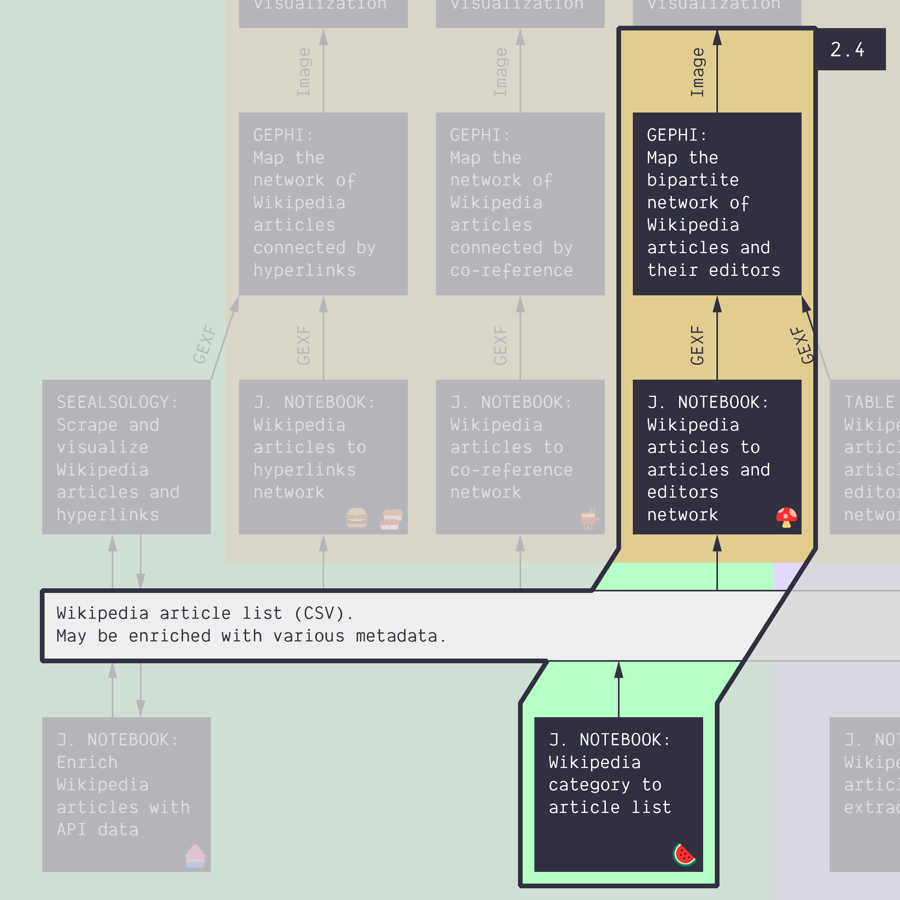

**Duration: 30 min**

[
	
](../assets/images/2-4.jpg)

**Goals**
* Check a **new notebook**
* **Harvest** a bipartite network from a Wikipedia category
* **Write a protocol** that is more complex
* **Activate your knowledge** about notebooks and digital methods

# Datum

```
Category:Energy conversion
```

# Task

This is an exercise and not a tutorial, although it introduces a new notebook. You get how it works, now, so our instructions get less detailed. The gist of it is to produce and analyze the network you have already visualized in the [tutorial 1.9](../1.9/) (and basically once again in the [1.11](../1.11/)): articles and editors. "Repetition is the mother of all learning", they say.

This is what we ask you to do:
1. Harvest the articles of the category *energy conversion* with a max level of 1 ([🍉&nbsp;notebook](https://colab.research.google.com/github/jacomyma/mapping-controversies/blob/main/notebooks/Wikipedia_category_to_article_list.ipynb)).
1. With that list, harvest the bipartite network of articles and editors, using this notebook: [🍄&nbsp;Wikipedia articles to articles and editors network](https://colab.research.google.com/github/jacomyma/mapping-controversies/blob/main/notebooks/Wikipedia_articles_to_articles_and_editors_network.ipynb)
1. Make a network map in Gephi (no need to annotate)
1. Write the visual protocol in Google Slides

**Recommendation:** as we have seen in previous tutorials, you will need to **filter your network** in Gephi. Your filtering settings, as well as any unusual operation, must be **featured in your visual protocol**.

# Documents produced

Keep somewhere, for sharing, the following documents:
* The image of the network map (JPEG or PNG)
* The image of the protocol (JPEG or PNG)

# Next tutorial

Take some rest before the big chunk of the morning!

[<i class="fas fa-forward"></i>&nbsp;2.5. Do your own network from a category *(45 min + 45 min)*](../2.5/)

---

### Relation to the course readings

* The process of getting data through scraping, crawling and calling APIs is covered in **Chapter 6: Collecting and curating digital records** of *Venturini, T. & Munk, A.K. (2021). Controversy Mapping: A Field Guide.*
* The intricacies of Wikipedia and the different ways in which the platform may be reappropriated for controversy analysis are covered in *Weltevrede, E., & Borra, E. (2016).* **Platform affordances and data practices: The value of dispute on Wikipedia**
*Big Data & Society, 3(1).*
* The principles and concepts of Visual Network Analysis (VNA) are covered in **Chapter 2: What is visual network analysis** in *Jacomy, M. (2021). Situating Visual Network Analysis*
* And in **Chapter 7: Visual network analysis** in *Venturini, T. & Munk, A.K. (2021). Controversy Mapping: A Field Guide*

### Tools for getting similar data (networks in GEXF or GDF format) from other sources:

* Networks of users, hashtags, or emojis from Twitter with the [Twitter Streaming Importer plugin for Gephi](https://github.com/seinecle/gephi-tutorials/blob/master/src/main/asciidoc/en/plugins/twitter-streaming-importer-en.adoc). Takes a list of words/#tags or a list of users as input.
* Networks of YouTube channels or YouTube videos connected by their relatedness (as meassured by the algorithmic recommendations) with the [YouTube Data Tools](https://tools.digitalmethods.net/netvizz/youtube/). Takes a list of video or channel ID's as input.
* Networks of scientific publications connected through keywords or citations with [ScienceScape](http://medialab.github.io/sciencescape/). Takes a full export from Scopus as input.
