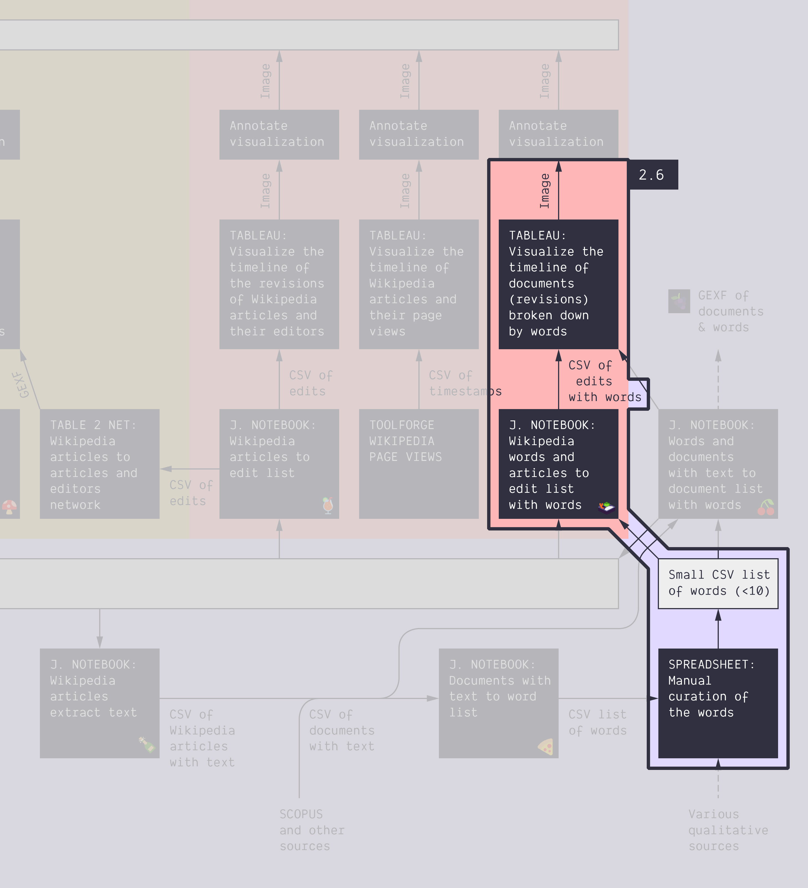

**Duration: 45 min**

**Goals**
* **Curate** a list of words in a Google Spreadsheet
* Check a **new notebook** to harvest the edit history from a semantic angle
* Visualize the data you have harvested in **Tableau**
* Check how the curation impacts the final result

# Case

The topic of *energy conversion* using the same two Wikipedia articles as in the [tutorial 1.2](../1.2/):
* [Space-based solar power](https://en.wikipedia.org/wiki/Space-based_solar_power)
* [Thorium-based nuclear power](https://en.wikipedia.org/wiki/Thorium-based_nuclear_power)

# Data

Download these two CSV files:

<a href="../assets/data/2-6/wikipedia-articles-tuto-2.6.csv">
	<i class="fas fa-file-csv" style="font-size:5em"></i> 
	wikipedia-articles-tuto-2.6.csv
</a>  

This file just contains the list of the two articles.

<a href="../assets/data/2-6/words.csv">
	<i class="fas fa-file-csv" style="font-size:5em"></i> 
	words.csv
</a>  

It just contains the list of 2,488 words mentionned in either articles. It was extracted from the [<i class="fas fa-file-csv"></i> text-enriched](../assets/data/2-6/wikipedia-articles-with-text-tuto-2.6.csv) version of the article list passed into this [🍕&nbsp;notebook](https://colab.research.google.com/github/jacomyma/mapping-controversies/blob/main/notebooks/Documents_with_text_to_word_list.ipynb). The text content of the articles was previously harvested by this other [🍾&nbsp;notebook](https://colab.research.google.com/github/jacomyma/mapping-controversies/blob/main/notebooks/Wikipedia_articles_extract_text.ipynb).

# Protocol

We ask you to enact this protocol (notice that parts of it has already been completed to get to the list of words you downloaded above):

* Make a selection of 5 to 20 words from the list, with the following criteria:
	* Each word must be represented in both articles
	* The words must be express a critical distance
	* If there are too many words to pick, then those mentionned the most must be prioritized
* Put these words in a small CSV file. It may look like [<i class="fas fa-file-csv"></i> this](../assets/data/2-6/words-small-list.csv).
* Extract the revisions of either article that contain either of your words.
	* Use this notebook: [🍱&nbsp;Wikipedia words and articles to edit list with words](https://colab.research.google.com/github/jacomyma/mapping-controversies/blob/main/notebooks/Wikipedia_words_and_articles_to_edit_list_with_words.ipynb).
	* One input is the CSV article list you downloaded above
	* The other input is your small list of words
	* You should obtain a file like [<i class="fas fa-file-csv"></i> this one](../assets/data/2-6/terms-and-revisions.csv).
* Visualize that data in Tableau (no need to annotate). Use the same approach as in the [tutorial 1.4](../1.4/).
* *Bonus*: do you see a data-driven story in this visualization?

It might look like this:

**Remark:** The curation of terms is different to that of the [tutorial 1.4](../1.4/), so even if the case and the visualization approach is the same, **the data-driven narrative is not the same**.

# Documents produced

Keep somewhere, for sharing, the following document:
* The (unannotated) visualization (JPEG or PNG)

# Next tutorial

Take a break before this:

[<i class="fas fa-forward"></i>&nbsp;2.7. Extend the protocol: natural language processing *(45 min)*](../2.7/)

---

### Relation to the course readings

* Thoughts and principles on query design are covered in *Rogers, Richard. (2017).* **Foundations of Digital Methods: Query Design** *The Datafied Society: Studying Culture through Data, eds: M. Schaefer and K. van Es*
* The process of getting data through scraping, crawling and calling APIs is covered in **Chapter 6: Collecting and curating digital records** of *Venturini, T. & Munk, A.K. (2021). Controversy Mapping: A Field Guide.*
* The intricacies of Wikipedia and the different ways in which the platform may be reappropriated for controversy analysis are covered in *Weltevrede, E., & Borra, E. (2016).* **Platform affordances and data practices: The value of dispute on Wikipedia**
*Big Data & Society, 3(1).*
