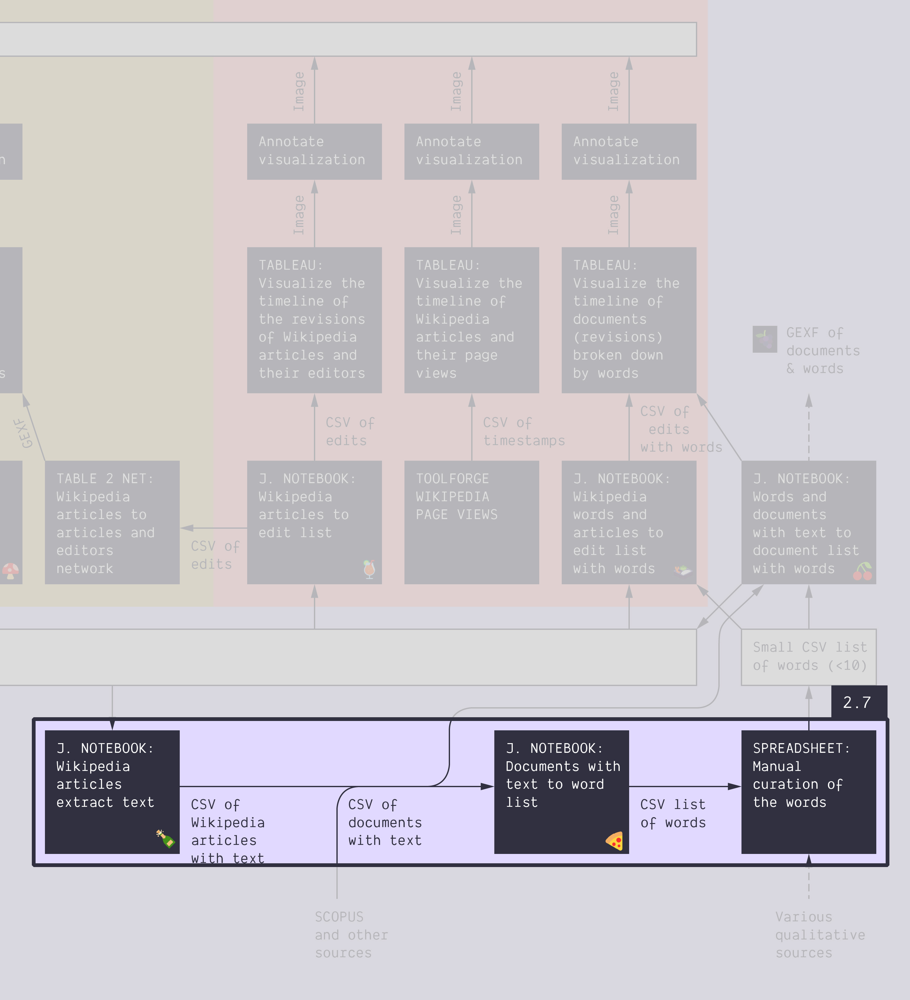

**Duration: 45 min**

[
	
](../assets/images/2-7.jpg)

**Goals**
* Tinker with **natural language processing** (NLP)
* Extend the protocol (document your curation choices)
* Check a **new notebook** to do NLP

# Data

Download this CSV:

<center><a href="../assets/data/2-7/energy-conversion-level-1-articles.csv">
	<i class="fas fa-file-csv" style="font-size:5em"></i><br>
	energy-conversion-level-1-articles.csv
</a><br><br></center>

It just contains the list of 879 articles in the Wikipedia category [energy conversion](https://en.wikipedia.org/wiki/Category:Energy_conversion) (including one level of subcategories). It was obtained from this notebook: [🍉&nbsp;Wikipedia category to article list](https://colab.research.google.com/github/jacomyma/mapping-controversies/blob/main/notebooks/Wikipedia_category_to_article_list.ipynb)

# Tasks

1. Extract the text of these articles
	* Use this notebook: [🍾&nbsp;Wikipedia articles extract text](https://colab.research.google.com/github/jacomyma/mapping-controversies/blob/main/notebooks/Wikipedia_articles_extract_text.ipynb)
	* You should obtain this [<i class="fas fa-file-csv"></i> CSV](../assets/data/2-7/wikipedia-articles-with-text.csv). It contains the same list of articles, but with their plain text.
1. Extract the main terms from the text of these articles
	* Use this notebook: [🍕&nbsp;Documents with text to word list](https://colab.research.google.com/github/jacomyma/mapping-controversies/blob/main/notebooks/Documents_with_text_to_word_list.ipynb)
	* Note: this notebook also works on non-Wikipedia data sets.
	* It gives you two different files:
		* The important terms ([<i class="fas fa-file-csv"></i> file](../assets/data/2-7/words.csv)).
			* The terms are [named entities](https://en.wikipedia.org/wiki/Named_entity). Think of them as interesting terms.
			* ```type``` is the type of named entity. Explanation in the notebook.
			* ```count-occurences-total``` takes into account multiple occurrences of a term in a same document
			* ```count-documents``` does not.
		* Which terms are in which documents ([<i class="fas fa-file-csv"></i> file](../assets/data/2-7/words-and-documents.csv)).
			* ```NE-type``` is the type of named entity. Explanation in the notebook.
			* ```NE-count``` is the number of occurrences of the named entity in the document.
1. Curate a list of the 20 to 100 **most important terms** (explanations follow)
	* You may use one or both of the files obtained from above
	* You may do this in a spreadsheet, or in Tableau
	* Pick a possible **data-driven story** for your selection of terms
	* Make clear methodological choices, and enforce them fully
	* This requires trial and error:
		* explore and tinker first to find a possible narrative,
		* then pick the method that works for you,
		* then re-enact the method properly, from scratch.
1. Make the visual protocol
	* In particular, **document your curation method**.
	* Mention the data-driven story that you hypothesize your curation angle supports.

# About curation

**What are the most important terms? *You decide!*** But you must justify it.

There is no neutral way to define what is important. You have to take a stance. It impacts the direction of the inquiry, that is why it is at stake. You are responsible for the direction of the inquiry. *You* drive the process.

In a real-world situation, you have research questions. Hypotheses, or at list a motivation for doing this. This is how you should decide what is important. Choose what is important to support your own angle on the data.

One cannot avoid curating because data science entails all sorts of reductions, and each reduction entails a non-neutral choice. In this case, we need a short list of terms for computational reasons. We cannot afford the time and/or computing power to take into account all of the terms, so we operate a reduction. It is a pragmatic decision.

In this case, you are free to pick any hypothetical data-driven story you want. At this stage, it is just a question begged by the data. You do not have to actually look into evidence (yet). It might be something simple: "Western countries are the most represented" or "nuclear risk is a concern". It might be multiple questions, it might be complicated. As you wish; but the terms must reflect the hypothesis/question.

**Examples of possible decisions:*
* To not take the named entities of types CARDINAL and PERCENT into account, because numbers are not relevant to the rhetoric of the case.
* To keep only the named entities of type DATE because the case is all about events.
* To take into account only a set of terms known to be controversial, because the actors themselves say those terms are the problematic ones.
* To take the top of the terms ranked by ```count-occurences-total```, because the repetition of terms in a same document is relevant to the research question. Example: normative terms matter.
* To take the top of the terms ranked by ```count-documents```, because the repetition of terms in a same document is *not* relevant to the research question. Example: we value the variety of the articles where the term appears.
* To remove some terms from the top, because they are used everywhere, and thus do not tell anything.
* To use the top 10 terms because the next step of the analysis is qualitative.
* To use the top 1000 terms because the next step of the analysis is quantitative.
* ...

# Documents produced

Keep somewhere, for sharing, the following document:
* The list of terms (just the list, as text)
* The visual protocol (JPEG or PNG)

# Next activity

🫖 Isn't it tea o'clock? After a good break, check this:

[<i class="fas fa-forward"></i>&nbsp;2.8. Write the protocol: Annotated Tableau dashboard of Scopus data *(45 min)*](../2.8/)

---

### Relation to the course readings

* Thoughts and principles on query design are covered in *Rogers, Richard. (2017).* **Foundations of Digital Methods: Query Design** *The Datafied Society: Studying Culture through Data, eds: M. Schaefer and K. van Es*