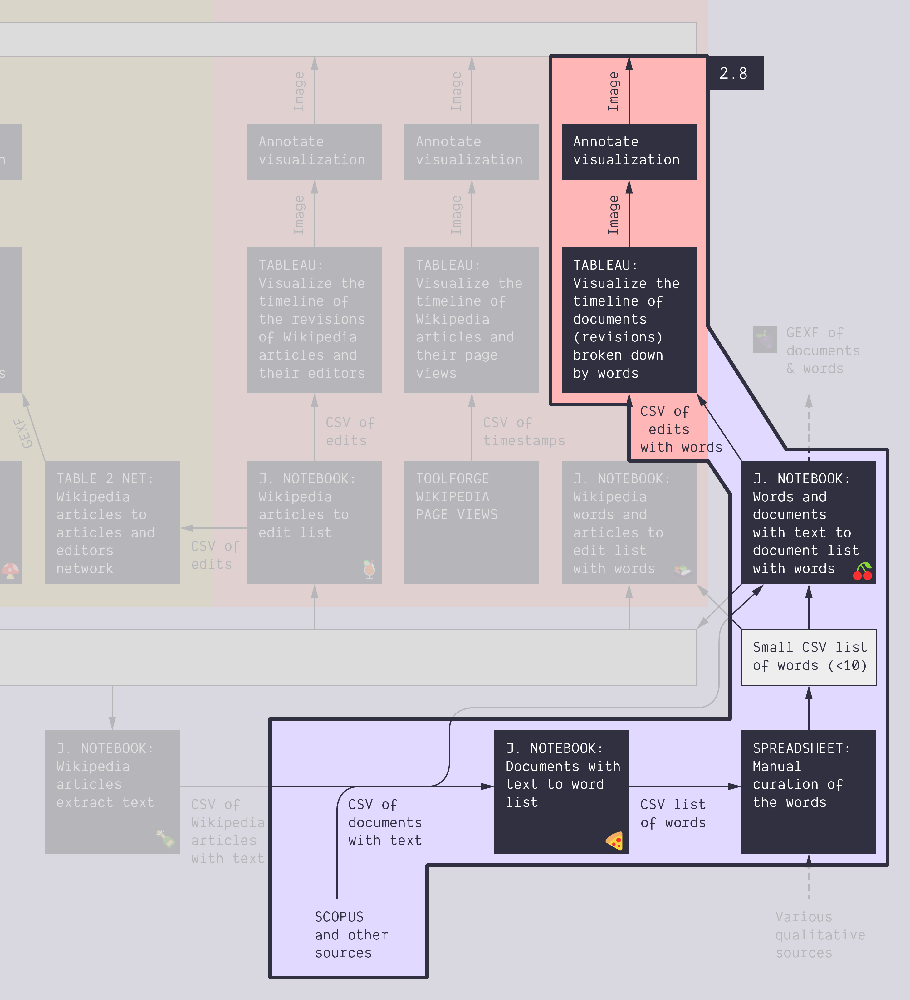

**Duration: 45 min**

**Goals**
* Activate your knowledge to analyze a **new kind of data**
* Discover scientometric data from **Scopus**
* Extract **semantic data** (words) from abstracts
* Make a Tableau **dashboard**
* **Annotate** the dashboard
* Write the **protocol**

# Case

**Fake news**. This time we situate the case in the **academic arena**: we will analyze scientific publications.

# Data

Download these two CSV files:

<a href="../assets/data/2-8/scopus-fake-news.csv">
	<i class="fas fa-file-csv" style="font-size:5em"></i> 
	scopus-fake-news.csv
</a>  

This is the list of the 1,761 **open access** academic publications mentionning the term "fake news" in their **abstract** in the [Scopus](https://www.scopus.com) database.

# Preliminary

Take a look at this file in Tableau. Understand its structure, it will help you later on.

# Task

Here is what we ask you:
1. Extract the important terms from the **abstracts**. It may look like [<i class="fas fa-file-csv"></i> this](../assets/data/2-8/words.csv). You will need this [🍕&nbsp;notebook](https://colab.research.google.com/github/jacomyma/mapping-controversies/blob/main/notebooks/Documents_with_text_to_word_list.ipynb).
2. Make a **selection of terms**.
3. With your selection and the list of documents, extract which terms are in which documents.
	* You will need this new notebook: [🍒&nbsp;Words and documents with text to document list with words](https://colab.research.google.com/github/jacomyma/mapping-controversies/blob/main/notebooks/Words_and_documents_with_text_to_document_list_with_words.ipynb).
	* It outputs three files:
		* The [<i class="fas fa-file-csv"></i> documents with terms as additional columns](../assets/data/2-8/documents-with-terms.csv)
		* The [<i class="fas fa-file-csv"></i> document-term pairs](../assets/data/2-8/terms-and-documents.csv)
		* A bipartite [<i class="fas fa-file"></i> network](../assets/data/2-8/terms-document-network.gexf) of terms and documents
4. Visualize the non-network data in Tableau as a **dashboard**, focusing on **time**.
5. Find a **data-driven narrative**.
	* This narrative **depends on your selection**, that is why you certainly have to **iterate** by refining your selection of terms and redoing the steps from point 2. to improve your narrative. You may have to do it several times.
6. **Annotate** your dashboard to support a data-driven story.
7. Write the **visual protocol.**

# Documents produced

Keep somewhere, for sharing, the following documents:
* The annotated visualization(s) (JPEG or PNG)
* The visual protocol (JPEG or PNG)

# Next activity

Take a short walk before the last activity of the day:

[<i class="fas fa-forward"></i>&nbsp;2.9. Write the protocol: Annotated Scopus author-article network map *(45 min)*](../2.9/)
