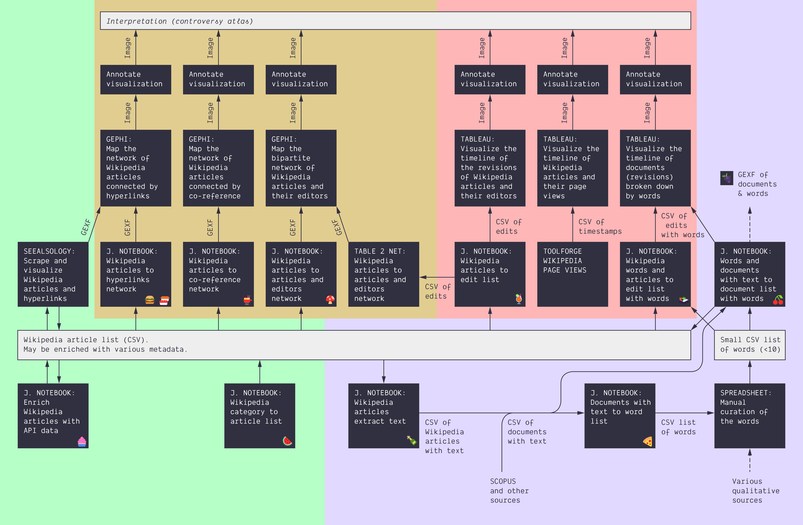

This tutorial material consists of 21 modules of 15 to 45 minutes, for 2 full days in total. It covers some of the technical / practical aspects of controversy mapping with digital methods. As such, it is designed to complement teaching on the controversy mapping course.

**Goal:** learn how to harvest and explore data, formulate insights, and build relatable visualizations.

**Data:** we will mostly use Wikipedia data to keep things relatively simple, but the techniques generalize to other media platforms and datasets.

**Tools:** we will mostly use Tableau, Gephi, and [Jupyter Notebooks](nb/). No experience required.

## Overview

Each tutorial covers a part of this general process, from data harvesting (bottom) to building a controversy atlas (top). Once through all the tutorials, the routes on this map provide a set of options for completing the practical steps of a controversy mapping project.

## Schedule

The schedule breaks down in 4 half-days. Each one focuses on a different topic, and requires 4 hours of work, split into 4 sessions of 45 minutes with 15 minutes breaks. That schedule is, however, quite intensive. You may want to slow down or skip some parts. We indicate which parts are necessary and which ones are optional.

The activities must be done in order, as they build on each other and ramp up in complexity. Each one comprises instructions and a set of practical tasks.

### Make a meaningful annotated visualization from a data file (Tableau software)

Build annotated timelines with Tableau Software, ~4 hours.

#### [1.1. Intro to Tableau software](1.1/)

Tutorial for Tableau and Google Slides for annotation.
 *30 min. Necessary.*

#### [1.2. Visualize a different dataset with Tableau](1.2/)

Advanced tutorial for Tableau, with exercises and active learning.
 *30 min. Necessary.*

#### [1.3. Build a simple dashboard](1.3/)

Tutorial for dashboards in Tableau.
 *30 min. Optional, but someone in your group should know how to do Dashboards.*

#### [1.4. A timeline of words](1.4/)

Exercise and active learning.
 *30 min. Optional but recommended. You should at least check that you are capable of making a meaningful annotated visualization from a data file with Tableau and Google Slides.*

#### [1.5. Harvest a dataset](1.5/)

Just a short introduction to data harvesting.
 *15 min. Necessary.*

#### [1.6. Harvest data with a notebook](1.6/)

Tutorial for Google Colab (Jupyter notebooks).
 *30 min. Necessary and very important.*

#### [1.7. Activate your knowledge about Tableau](1.7/)

Exercise: activate what you have learned.
 *30 min. Optional but recommended. You should at least check that you are capable of making a meaningful annotated visualization from scratch (including harvesting).*

### Visualizing networks (Gephi)

Build annotated network maps with Gephi, ~4 hours.

#### [1.8. Intro to Gephi & Visualize clusters](1.8/)

Tutorial for Gephi.
 *45 min. Necessary.*

* [1.9. Visualize a bipartite network *(30 min)*](1.9/)
* [1.10. Visualize a weighted network *(15 min)*](1.10/)
* BREAK *(15 min)*
* [1.11. From data to network with Table2Net *(45 min)*](1.11/)
* BREAK *(15 min)*
* [1.12. Activate your knowledge about Gephi *(45 min)*](1.12/)

### Harvest relational data

Write visual protocols for relational data, ~4 hours.

* [2.1. Follow the protocol: scrape a network with SeeAlsology *(15 min)*](2.1/)
* [2.2. Write the protocol: scrape from one article with SeeAlsology *(30 min)*](2.2/)
* BREAK *(15 min)*
* [2.3. Follow the protocol: co-reference network from a category *(15 min)*](2.3/)
* [2.4. Write the protocol: Article-editor network from a category *(30 min)*](2.4/)
* BREAK *(15 min)*
* [2.5. Do your own network from a category *(45 min + 45 min)*](2.5/)

### Harvest other data

Write visual protocols for other kinds of data, ~4 hours.

* [2.6. Follow the protocol: words, from manual curation to Tableau *(45 min)*](2.6/)
* BREAK *(15 min)*
* [2.7. Extend the protocol: natural language processing *(45 min)*](2.7/)
* BREAK *(15 min)*
* [2.8. Write the protocol: Annotated Tableau dashboard of Scopus data *(45 min)*](2.8/)
* BREAK *(15 min)*
* [2.9. Write the protocol: Annotated Scopus author-article network map *(45 min)*](2.9/)

## Resources
* [List of included Jupyter notebooks](nb/)

## License
[![CC BY-SA 4.0][cc-by-sa-image]][cc-by-sa]

[cc-by-sa]: http://creativecommons.org/licenses/by-sa/4.0/
[cc-by-sa-image]: https://licensebuttons.net/l/by-sa/4.0/88x31.png